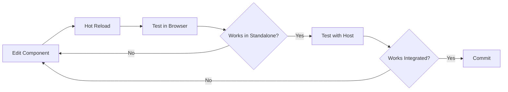

## Prerequisites

<CardGroup cols={2}>
  <Card title="Node.js 20+" icon="node-js">
    Required runtime
  </Card>
  <Card title="pnpm 9+" icon="box">
    Package manager
  </Card>
  <Card title="Hosts Entry" icon="server">
    local.vrittiai.com configured
  </Card>
  <Card title="Backend Running" icon="database">
    vritti-api-nexus on :3000
  </Card>
</CardGroup>

## Step 1: Clone and Install

```bash
# Clone the repository
git clone <repository-url> vritti-auth
cd vritti-auth

# Install dependencies
pnpm install
```

## Step 2: Configure Hosts File

Add the following to your hosts file if not already added:

```bash
# /etc/hosts (macOS/Linux) or C:\Windows\System32\drivers\etc\hosts (Windows)
127.0.0.1 local.vrittiai.com
```

## Step 3: Environment Configuration

Create a `.env` file:

```bash
# API Configuration
REACT_API_HOST=http://localhost:3000

# HTTPS Mode (optional)
USE_HTTPS=false
```

## Step 4: SSL Certificates (Optional)

For HTTPS development:

```bash
# Install mkcert
brew install mkcert
mkcert -install

# Generate certificates
mkdir -p certs
cd certs
mkcert "local.vrittiai.com" localhost 127.0.0.1 ::1
```

## Step 5: Start Development Server

<Tabs>
  <Tab title="HTTP">
    ```bash
    pnpm dev
    ```
    Access at: http://local.vrittiai.com:3001
  </Tab>
  <Tab title="HTTPS">
    ```bash
    pnpm dev:ssl
    ```
    Access at: https://local.vrittiai.com:3001
  </Tab>
</Tabs>

## Running with Host

To see auth pages integrated with the host:

```bash
# Terminal 1: Start API backend
cd ../vritti-api-nexus
pnpm dev

# Terminal 2: Start auth remote
cd ../vritti-auth
pnpm dev

# Terminal 3: Start host application
cd ../vritti-web-nexus
pnpm dev:cloud
```

Then access: http://cloud.local.vrittiai.com:3012/login

## Standalone Development

vritti-auth can run standalone for isolated development:

```bash
pnpm dev
# Visit http://local.vrittiai.com:3001/login directly
```

<Note>
Standalone mode requires the backend API to be running for authentication to work.
</Note>

## Available Scripts

| Script | Command | Description |
|--------|---------|-------------|
| `dev` | `pnpm dev` | Start dev server on :3001 |
| `dev:ssl` | `pnpm dev:ssl` | Start with HTTPS |
| `build` | `pnpm build` | Production build |
| `preview` | `pnpm preview` | Preview production build |
| `lint` | `pnpm lint` | Run Biome linting |
| `format` | `pnpm format` | Format code |
| `check` | `pnpm check` | Full code quality check |

## Starting the Application

vritti-auth can run in two modes: **standalone** or **integrated with host**.

<Steps>
  <Step title="Ensure Backend is Running">
    ```bash
    # In vritti-api-nexus directory
    pnpm dev
    # API should be accessible at http://local.vrittiai.com:3000
    ```
  </Step>

  <Step title="Choose Development Mode">
    <Tabs>
      <Tab title="Standalone HTTP">
        ```bash
        pnpm dev
        ```
        **Access at**: http://local.vrittiai.com:3001/login

        **Use case**: Isolated development and testing of auth flows
      </Tab>

      <Tab title="Standalone HTTPS">
        ```bash
        pnpm dev:ssl
        ```
        **Access at**: https://local.vrittiai.com:3001/login

        **Use case**: Testing WebAuthn/Passkey features (requires HTTPS)
      </Tab>

      <Tab title="Integrated with Host">
        ```bash
        # Terminal 1: Start auth remote
        pnpm dev

        # Terminal 2: Start host application
        cd ../vritti-web-nexus
        pnpm dev:cloud
        ```
        **Access at**: http://cloud.local.vrittiai.com:3012/login

        **Use case**: Testing full integration with host application
      </Tab>
    </Tabs>
  </Step>

  <Step title="Verify Server is Running">
    Check the following:

    | Check | URL | Expected |
    |-------|-----|----------|
    | Manifest | http://local.vrittiai.com:3001/mf-manifest.json | JSON response |
    | Login page | http://local.vrittiai.com:3001/login | Login form |
    | API proxy | http://local.vrittiai.com:3001/api/health | Health check response |
  </Step>
</Steps>

### Protocol Detection

The server automatically detects the protocol based on the `USE_HTTPS` environment variable:

```typescript
// In rsbuild.config.ts
const useHttps = process.env.USE_HTTPS === 'true';
const protocol = useHttps ? 'https' : 'http';
```

<Warning>
**Protocol Matching**: When running with vritti-web-nexus (host), both applications MUST use the same protocol (HTTP or HTTPS) to avoid mixed content errors.
</Warning>

### Port and Access URLs

| Mode | Port | Access URL |
|------|------|------------|
| Standalone HTTP | 3001 | http://local.vrittiai.com:3001 |
| Standalone HTTPS | 3001 | https://local.vrittiai.com:3001 |
| Integrated HTTP | 3001 + 3012 | http://cloud.local.vrittiai.com:3012 |
| Integrated HTTPS | 3001 + 3012 | https://cloud.local.vrittiai.com:3012 |

**Important Notes**:
- Auth remote always runs on port **3001**
- Host application (vritti-web-nexus) runs on port **3012**
- Manifest URL: `{protocol}://local.vrittiai.com:3001/mf-manifest.json`
- WebAuthn/Passkey features require **HTTPS mode**

## Build Configuration

The `rsbuild.config.ts` configures:

### Server Settings

```typescript
server: {
  port: 3001,
  host: 'local.vrittiai.com',
}
```

### Module Federation

```typescript
pluginModuleFederation({
  name: 'vritti_auth',
  exposes: {
    './routes': './src/routes.tsx',
  },
})
```

### API Proxy

```typescript
proxy: {
  '/api': {
    target: process.env.REACT_API_HOST || 'http://localhost:3000',
    changeOrigin: true,
    pathRewrite: { '^/api': '' },
  },
}
```

## Project Dependencies

### Core Dependencies

| Package | Version | Purpose |
|---------|---------|---------|
| `react` | 19.2.3 | UI framework |
| `react-router-dom` | 7.12.0 | Routing |
| `@tanstack/react-query` | 5.90.19 | Server state |
| `react-hook-form` | 7.71.1 | Form handling |
| `zod` | 4.3.5 | Validation |

### Authentication

| Package | Version | Purpose |
|---------|---------|---------|
| `@simplewebauthn/browser` | 13.2.2 | WebAuthn/Passkey |
| `qrcode.react` | 4.2.0 | QR code generation |

### UI Components

| Package | Version | Purpose |
|---------|---------|---------|
| `@vritti/quantum-ui` | 0.2.7 | Design system |
| `lucide-react` | 0.562.0 | Icons |
| `tailwind-merge` | 3.3.1 | CSS class merging |

## Troubleshooting

<Accordion title="Login redirects to blank page">
  **Cause:** Host not running or manifest not loading

  **Solutions:**
  1. Start vritti-web-nexus on port 3012
  2. Check that mf-manifest.json is accessible at :3001
  3. Verify shared dependencies match
</Accordion>

<Accordion title="API requests fail with CORS">
  **Cause:** Backend not running or proxy misconfigured

  **Solutions:**
  1. Start vritti-api-nexus on port 3000
  2. Check proxy configuration in rsbuild.config.ts
  3. Verify REACT_API_HOST environment variable
</Accordion>

<Accordion title="OAuth callback fails">
  **Cause:** Callback URL not configured in provider

  **Solutions:**
  1. Add callback URL to OAuth provider settings
  2. Use correct environment (local/staging/production)
  3. Check API OAuth configuration
</Accordion>

<Accordion title="WebAuthn not working">
  **Cause:** HTTPS required or unsupported browser

  **Solutions:**
  1. Use HTTPS mode: `pnpm dev:ssl`
  2. Use a WebAuthn-compatible browser (Chrome, Safari, Firefox)
  3. Check browser DevTools for specific errors
</Accordion>

<Accordion title="Onboarding step not advancing">
  **Cause:** Backend status mismatch

  **Solutions:**
  1. Check network tab for status endpoint response
  2. Verify user record in database
  3. Clear cookies and restart flow
</Accordion>

## File Structure

```
src/
├── components/
│   ├── auth/
│   │   ├── SocialAuthButtons.tsx    # OAuth buttons
│   │   ├── AuthDivider.tsx          # "or" divider
│   │   └── mfa-verification/        # MFA components
│   ├── icons/                       # Social icons
│   ├── layouts/
│   │   └── AuthLayout.tsx           # Shared layout
│   └── onboarding/
│       ├── OnboardingRouter.tsx     # Step router
│       └── mfa/                     # MFA setup components
├── context/
│   └── OnboardingProvider.tsx       # Onboarding state
├── hooks/
│   ├── useLogin.ts                  # Login mutation
│   ├── useSignup.ts                 # Signup mutation
│   ├── useVerifyEmail.ts            # Email verification
│   ├── useSetPassword.ts            # Password setup
│   ├── usePasskey.ts                # WebAuthn hooks
│   └── use2FA.ts                    # TOTP hooks
├── pages/
│   ├── auth/
│   │   ├── LoginPage.tsx
│   │   ├── SignupPage.tsx
│   │   └── MFAVerificationPage.tsx
│   └── onboarding/
│       ├── VerifyEmailPage.tsx
│       ├── VerifyMobileFlowPage.tsx
│       ├── SetPasswordPage.tsx
│       └── MFASetupFlowPage.tsx
├── services/
│   ├── auth.service.ts
│   └── onboarding.service.ts
├── schemas/
│   └── auth.ts                      # Zod schemas
└── routes.tsx                       # Exported routes
```

## Development Workflow



## Related Documentation

<CardGroup cols={2}>
  <Card title="Auth Overview" icon="user-lock" href="/projects/auth/overview">
    Project overview
  </Card>
  <Card title="Pages & Flows" icon="sitemap" href="/projects/auth/pages-flows">
    Page documentation
  </Card>
  <Card title="OAuth Setup" icon="key" href="/features/oauth/overview">
    OAuth configuration
  </Card>
  <Card title="Web Nexus" icon="house" href="/projects/web-nexus/overview">
    Host application
  </Card>
</CardGroup>
