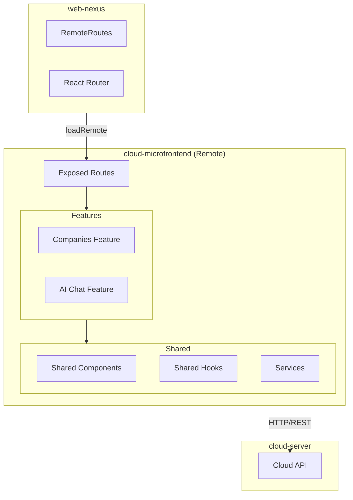

<Info>
**Project:** cloud-microfrontend
**Type:** Remote Application (Module Federation)
**Port:** 3002
**Host:** local.vrittiai.com
</Info>

cloud-microfrontend is the cloud product dashboard micro-frontend. It exposes its routes via Module Federation to be consumed by web-nexus (the host application), and communicates with cloud-server for all data operations.

## What It Does

- Provides the cloud product dashboard UI
- Manages company listings and detail views
- Handles AI chat interactions
- Exposes routes for host application integration via Module Federation

## Tech Stack

| Technology | Version | Purpose |
|------------|---------|---------|
| React | 19.2.3 | UI framework |
| Rsbuild | 1.7.x | Build tool with Module Federation |
| Module Federation | 0.22.1 | Micro-frontend runtime |
| React Router | 7.x | Client-side routing |
| TanStack Query | 5.x | Server state management |
| react-hook-form | 7.x | Form management |
| Zod | 4.x | Schema validation |
| Tailwind CSS | 4.x | Utility-first styling |
| @vritti/quantum-ui | 0.2.x | Design system |

## Architecture



## Project Structure

```
cloud-microfrontend/
├── src/
│   ├── features/               # Feature-specific modules
│   │   ├── companies/          # Company management
│   │   └── ai-chat/            # AI chat feature
│   ├── pages/                  # Page components
│   ├── components/             # Shared UI components
│   ├── hooks/                  # Shared hooks
│   ├── services/               # API service functions
│   ├── shared/                 # Shared utilities and types
│   ├── lib/                    # Library integrations
│   ├── utils/                  # Utility functions
│   ├── routes.tsx              # Exposed routes
│   ├── index.tsx               # Entry point
│   └── index.css               # Global styles
├── rsbuild.config.ts           # Build & MF configuration
└── package.json
```

## Module Federation

### Exposed Module

cloud-microfrontend exposes its routes for the host:

```typescript
// rsbuild.config.ts
pluginModuleFederation({
  name: 'cloud_microfrontend',
  exposes: {
    './routes': './src/routes.tsx',
  },
  shared: {
    react: { singleton: true, eager: true },
    'react-dom': { singleton: true, eager: true },
    'react-router-dom': { singleton: true, eager: true },
    '@vritti/quantum-ui': { singleton: true, eager: true },
    axios: { singleton: true, eager: true },
    '@tanstack/react-query': { singleton: true, eager: true },
  },
})
```

### Route Export

```typescript
// src/routes.tsx
export const cloudRoutes: RouteObject[] = [
  {
    path: '/cloud',
    element: <CloudLayout />,
    children: [
      { index: true, element: <Navigate to="/cloud/companies" replace /> },
      { path: 'companies', element: <CompaniesPage /> },
      { path: 'companies/:slug', element: <CompanyDetailPage /> },
      { path: 'ai-chat', element: <AIChatPage /> },
    ],
  },
];
```

## Key Features

### Feature-Based Organization

Code is organized by feature domain rather than technical layer:

```
features/
├── companies/
│   ├── components/     # Company-specific components
│   ├── hooks/          # Company-specific hooks
│   ├── services/       # Company API calls
│   └── pages/          # Company pages
└── ai-chat/
    ├── components/     # Chat UI components
    ├── hooks/          # Chat hooks
    └── services/       # Chat API calls
```

### quantum-ui Integration

Configured via `quantum-ui.config.ts` before rendering:

```typescript
import { configureQuantumUI } from '@vritti/quantum-ui';
import quantumUIConfig from '../quantum-ui.config';

configureQuantumUI(quantumUIConfig);
```

<Warning>
  Always call `configureQuantumUI` before the app renders. Without this, quantum-ui falls back to defaults (wrong endpoints, wrong baseURL).
</Warning>

### Slug-Based Routes

Detail pages use `buildSlug` for human-readable URLs:

```typescript
import { buildSlug } from '@vritti/quantum-ui/utils/slug';
import { useSlugParams } from '@vritti/quantum-ui/hooks';

// Navigate to company detail
navigate(`/cloud/companies/${buildSlug(company.name, company.id)}`);

// In CompanyDetailPage — route param must be named :slug
const { id } = useSlugParams();
```

## Shared Dependencies

The remote shares singleton libraries with the host:

| Dependency | Strategy | Purpose |
|------------|----------|---------|
| `react` | Singleton, Eager | UI framework |
| `react-dom` | Singleton, Eager | DOM rendering |
| `react-router-dom` | Singleton | Routing |
| `@vritti/quantum-ui` | Singleton | Design system |
| `axios` | Singleton | HTTP client |
| `@tanstack/react-query` | Singleton | Server state |

## Environment Variables

Environment variables use the `PUBLIC_` prefix via `import.meta.env`:

| Variable | Purpose |
|----------|---------|
| `PUBLIC_MF_BASE_URL` | Module Federation base URL (production) |

## Development

### Start Development Server

```bash
pnpm dev      # http://local.vrittiai.com:3002
pnpm dev:ssl  # https://local.vrittiai.com:3002
```

### Build

```bash
pnpm build  # TypeScript check + Rsbuild build
```

<Info>
  The build command runs `tsc --noEmit` first to catch type errors before bundling.
</Info>

## Related Documentation

<CardGroup cols={2}>
  <Card title="web-nexus" icon="window" href="/projects/web-nexus/overview">
    Module Federation host
  </Card>
  <Card title="cloud-server" icon="cloud" href="/projects/cloud-server/overview">
    Cloud backend API
  </Card>
  <Card title="Module Federation" icon="cubes" href="/architecture/frontend/module-federation">
    Architecture overview
  </Card>
  <Card title="Frontend Conventions" icon="code" href="/guidelines/frontend/component-patterns">
    Component and hook patterns
  </Card>
</CardGroup>
