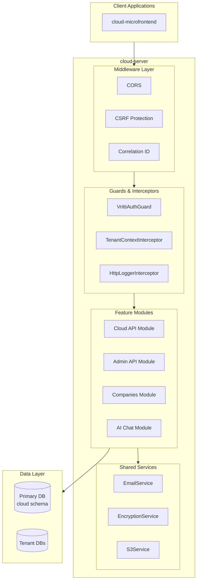

**cloud-server** is the backend API for Vritti's cloud product. Built with NestJS 11 and Fastify 5, it powers the cloud dashboard — handling company management, deployments, AI chat, and admin operations.

## Technology Stack

| Technology | Version | Purpose |
|------------|---------|---------|
| NestJS | 11.x | Application framework |
| Fastify | 5.7.x | HTTP server |
| Drizzle ORM | 1.0.0-beta.x | Type-safe PostgreSQL ORM |
| TypeScript | 5.7 | Language |
| SWC | Latest | Fast TypeScript compilation |
| Biome | 2.4.x | Linting and formatting |
| Jest | 30.x | Testing framework |

## Architecture Overview



## Project Structure

```
cloud-server/
├── src/
│   ├── config/                 # Environment validation, JWT config
│   ├── db/
│   │   ├── schema/             # Drizzle ORM table definitions
│   │   └── migrations/         # Database migrations
│   ├── modules/
│   │   ├── cloud-api/          # Cloud product routes
│   │   ├── admin-api/          # Admin routes
│   │   ├── companies/          # Company management
│   │   └── ai-chat/            # AI chat features
│   ├── services/               # Shared services (email, S3, etc.)
│   ├── utils/                  # Utility functions
│   ├── app.module.ts           # Root module
│   └── main.ts                 # Bootstrap
├── test/                       # Test configuration
├── certs/                      # SSL certificates
├── drizzle.config.ts           # ORM configuration
└── openapi.json                # Generated API spec
```

## Feature Modules

<CardGroup cols={2}>
  <Card title="Cloud API Module" icon="cloud">
    Core cloud product routes — the primary API surface for the cloud dashboard
  </Card>
  <Card title="Admin API Module" icon="shield">
    Internal admin endpoints for platform management and operations
  </Card>
  <Card title="Companies Module" icon="building">
    Company registry, membership management, and company-level configuration
  </Card>
  <Card title="AI Chat Module" icon="robot">
    AI-powered chat features with conversation history and context management
  </Card>
</CardGroup>

## Key Features

### Authentication

Uses `@vritti/api-sdk` for JWT-based authentication:

- **JWT Tokens**: Short-lived access tokens (15 min) + long-lived refresh tokens (30 days)
- **Token Binding**: Access tokens contain refresh token hash for additional security
- **CSRF Protection**: HMAC-based CSRF tokens for all state-changing requests

### File Storage

AWS S3 integration for file uploads and storage:

```typescript
// S3 pre-signed URLs for secure uploads
import { S3Service } from './services/s3.service';

const uploadUrl = await s3Service.getPresignedUploadUrl(key, contentType);
```

### Logging

- **Winston Logger**: Structured JSON logging in production
- **PII Masking**: Automatic masking of emails, phone numbers
- **Correlation IDs**: Request tracking across services
- **File Rotation**: Daily log rotation with configurable retention

## Configuration Patterns

### Environment Variable Extraction

Extract all environment variables into a single `ENV` constant at the top of `main.ts`:

```typescript
const ENV = {
  nodeEnv: process.env.NODE_ENV,
  useHttps: process.env.USE_HTTPS === 'true',
  port: process.env.PORT ?? 3000,
  host: 'local.vrittiai.com',
  refreshCookieName: process.env.REFRESH_COOKIE_NAME ?? 'vritti_refresh',
  refreshCookieDomain: process.env.REFRESH_COOKIE_DOMAIN,
} as const;
```

## API Routes

| Prefix | Module | Description |
|--------|--------|-------------|
| `/cloud-api/*` | CloudApiModule | Cloud product operations |
| `/admin-api/*` | AdminApiModule | Admin operations |
| `/companies/*` | CompaniesModule | Company management |
| `/ai-chat/*` | AIChatModule | AI chat endpoints |
| `/csrf-token` | CsrfController | CSRF token endpoint |

## Dependencies

### Internal Packages

| Package | Purpose |
|---------|---------|
| `@vritti/api-sdk` | Auth guards, database module, decorators, logging |

### Key External Dependencies

| Package | Purpose |
|---------|---------|
| `@fastify/cookie` | Cookie handling |
| `@fastify/csrf-protection` | CSRF protection |
| `@fastify/multipart` | File upload handling |
| `@aws-sdk/client-s3` | S3 file storage |
| `@getbrevo/brevo` | Email service |
| `drizzle-orm` | Database ORM |
| `drizzle-kit` | Migration tooling |
| `argon2` | Password hashing |

## Database Commands

```bash
# Generate migrations
pnpm db:generate

# Push schema changes (dev)
pnpm db:push

# Run migrations (production)
pnpm db:migrate

# Open Drizzle Studio
pnpm db:studio
```

## Development

```bash
# Start dev server
pnpm dev

# Start with SSL
pnpm dev:ssl

# Run tests
pnpm test
```

**Port:** 3000 (API), 3000/api/docs (Swagger)

## Next Steps

<CardGroup cols={2}>
  <Card title="api-nexus" icon="server" href="/projects/api-nexus/overview">
    Platform backend API (auth, tenants, users)
  </Card>
  <Card title="cloud-microfrontend" icon="chart-bar" href="/projects/cloud-microfrontend/overview">
    Cloud dashboard frontend
  </Card>
</CardGroup>
