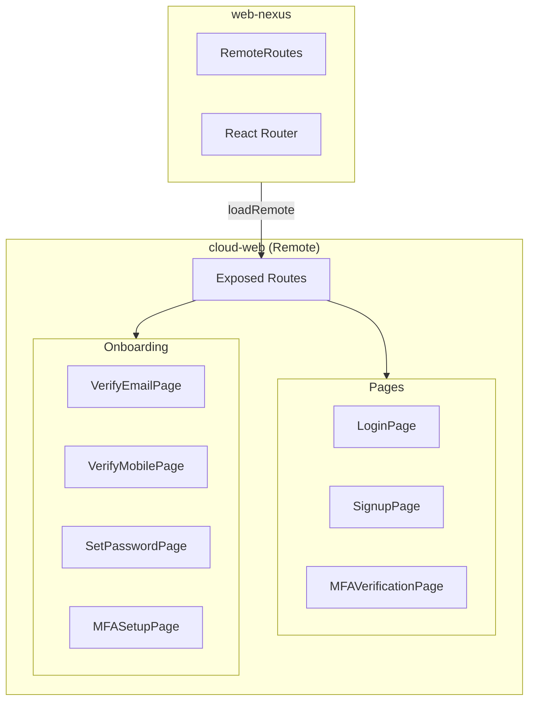
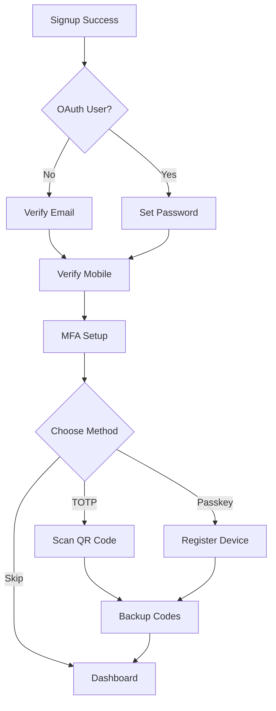

<Info>
**Project:** cloud-web
**Type:** Remote Application (Module Federation) + Standalone Web App
**Port:** 3001
**Host:** local.vrittiai.com
</Info>

cloud-web is the standalone authentication and account management web app for Vritti. It handles all authentication and onboarding flows and also exposes its routes via Module Federation to be consumed by the host application (web-nexus).

## What It Does

- Provides login and signup pages with form validation
- Supports OAuth social login (Google, Microsoft, Facebook, Twitter, Apple)
- Handles multi-factor authentication (TOTP, SMS, Passkey)
- Manages complete onboarding flow (email, phone, password, 2FA setup)
- Exposes routes for host application integration via Module Federation

## Tech Stack

| Technology | Version | Purpose |
|------------|---------|---------|
| React | 19.2.3 | UI framework |
| Rsbuild | 1.7.2 | Build tool with Module Federation |
| React Router | 7.12.0 | Routing |
| TanStack Query | 5.90.19 | Server state management |
| react-hook-form | 7.71.1 | Form management |
| Zod | 4.3.5 | Schema validation |
| @vritti/quantum-ui | 0.2.7 | Design system |
| @simplewebauthn/browser | 13.2.2 | WebAuthn/Passkey support |

## Architecture



## Project Structure

```
cloud-web/
├── src/
│   ├── components/
│   │   ├── auth/                    # Auth UI components
│   │   │   ├── SocialAuthButtons.tsx
│   │   │   ├── AuthDivider.tsx
│   │   │   └── mfa-verification/
│   │   ├── icons/                   # Social provider icons
│   │   ├── layouts/
│   │   │   └── AuthLayout.tsx
│   │   └── onboarding/
│   │       ├── OnboardingRouter.tsx
│   │       └── mfa/
│   ├── context/
│   │   └── OnboardingProvider.tsx   # Onboarding state
│   ├── hooks/                       # API hooks
│   │   ├── auth/
│   │   │   ├── useLogin.ts
│   │   │   ├── useSignup.ts
│   │   │   └── index.ts
│   │   └── onboarding/
│   │       └── index.ts
│   ├── pages/
│   │   ├── auth/                    # Auth pages
│   │   └── onboarding/              # Onboarding pages
│   ├── services/
│   │   ├── auth.service.ts
│   │   └── onboarding.service.ts
│   ├── schemas/
│   │   └── auth.ts                  # Zod schemas
│   └── routes.tsx                   # Exposed routes
├── rsbuild.config.ts
└── package.json
```

## Module Federation

### Exposed Module

cloud-web exposes its routes for the host:

```typescript
// rsbuild.config.ts
pluginModuleFederation({
  name: 'cloud_web',
  exposes: {
    './routes': './src/routes.tsx',
  },
  shared: {
    react: { singleton: true, eager: true },
    'react-dom': { singleton: true, eager: true },
    'react-router-dom': { singleton: true, eager: true },
    '@vritti/quantum-ui': { singleton: true, eager: true },
    axios: { singleton: true, eager: true },
    '@tanstack/react-query': { singleton: true, eager: true },
  },
})
```

### Route Export

```typescript
// src/routes.tsx
export const authRoutes: RouteObject[] = [
  {
    path: '/',
    element: <AuthLayout />,
    children: [
      { index: true, element: <Navigate to="/login" replace /> },
      { path: 'login', element: <LoginPage /> },
      { path: 'signup', element: <SignupPage /> },
      { path: 'signup-success', element: <SignupSuccessPage /> },
      { path: 'forgot-password', element: <ForgotPasswordPage /> },
      { path: 'mfa-verify', element: <MFAVerificationPage /> },
      {
        path: 'onboarding',
        element: <OnboardingProvider><Outlet /></OnboardingProvider>,
        children: [
          { index: true, element: <OnboardingRouter /> },
        ],
      },
    ],
  },
];
```

## Rsbuild Configuration

cloud-web uses optimized Rsbuild configuration patterns for efficient builds and Module Federation setup.

### Shared Dependencies

Shared dependencies are extracted to a constant for reusability:

```typescript
const SHARED_DEPENDENCIES = {
  react: {
    singleton: true,
    requiredVersion: '^19.2.0',
    eager: true,
  },
  'react-dom': {
    singleton: true,
    requiredVersion: '^19.2.0',
    eager: true,
  },
  'react-router-dom': {
    singleton: true,
    requiredVersion: '^7.2.0',
  },
  '@vritti/quantum-ui': {
    singleton: true,
    requiredVersion: '^0.2.7',
  },
  '@tanstack/react-query': {
    singleton: true,
    requiredVersion: '^5.66.1',
  },
} as const;
```

This ensures:
- **Singleton behavior**: Only one version loaded across host and remotes
- **Version requirements**: Enforces compatible versions
- **Eager loading**: Critical dependencies (React) load immediately

### Custom Plugins with Proper Typing

Custom Rsbuild plugins are typed with `RsbuildPlugin` interface:

```typescript
import type { RsbuildPlugin } from '@rsbuild/core';

const manifestMessagePlugin: RsbuildPlugin = {
  name: 'plugin-manifest-message',
  setup: (api) => {
    api.onAfterStartDevServer(({ port }) => {
      const protocol = useHttps ? 'https' : 'http';
      api.logger.info(`➜  Manifest: ${protocol}://${host}:${port}/mf-manifest.json`);
    });
  },
};
```

**Benefits**:
- Type-safe plugin development
- Auto-completion in IDE
- Compile-time error checking

### Environment Configuration

Environment variables are extracted and cached:

```typescript
const useHttps = process.env.USE_HTTPS === 'true';
const host = 'local.vrittiai.com';
const protocol = useHttps ? 'https' : 'http';
const port = 3001;
```

## Authentication Features

### Login

- Email and password authentication
- Social login buttons (5 providers)
- MFA verification redirect when required
- Remember device option

### Signup

- Full name, email, password registration
- Password strength indicator
- Real-time password match validation
- Terms and privacy acceptance
- Social signup support

### MFA Verification

Three verification methods:

| Method | Description |
|--------|-------------|
| TOTP | 6-digit code from authenticator app |
| SMS | 6-digit code sent to phone |
| Passkey | WebAuthn biometric/hardware key |

## Onboarding Flow



### Onboarding Steps

| Step | Page | Purpose |
|------|------|---------|
| EMAIL_VERIFICATION | VerifyEmailPage | OTP verification |
| SET_PASSWORD | SetPasswordPage | For OAuth users |
| PHONE_VERIFICATION | VerifyMobilePage | WhatsApp/SMS/OTP |
| MFA_SETUP | MFASetupPage | 2FA configuration |
| COMPLETED | - | Redirect to dashboard |

## State Management

### OnboardingContext

```typescript
interface OnboardingContextType {
  currentStep: OnboardingStep;
  email: string;
  phone?: string;
  isLoading: boolean;
  refetch: () => void;
}
```

The provider fetches status from `/cloud-api/onboarding/status` to determine the current step, preventing URL manipulation.

### API Hooks

| Hook | Purpose |
|------|---------|
| `useLogin` | Login mutation |
| `useSignup` | Signup mutation |
| `useVerifyEmail` | Email OTP verification |
| `useSetPassword` | Password setup |
| `useMobileVerificationSSE` | Real-time mobile verification |
| `usePasskey` | WebAuthn registration/verification |
| `use2FA` | TOTP setup and verification |

## Security Features

<CardGroup cols={2}>
  <Card title="WebAuthn" icon="fingerprint">
    Passkey support for passwordless auth
  </Card>
  <Card title="TOTP" icon="clock">
    Time-based one-time passwords
  </Card>
  <Card title="SSE Verification" icon="bolt">
    Real-time mobile verification status
  </Card>
  <Card title="Backup Codes" icon="key">
    Account recovery options
  </Card>
</CardGroup>

## Development

### Start Development Server

```bash
pnpm dev      # http://local.vrittiai.com:3001
pnpm dev:ssl  # https://local.vrittiai.com:3001
```

### Build

```bash
pnpm build  # Generates mf-manifest.json
```

## Related Documentation

<CardGroup cols={2}>
  <Card title="Setup Guide" icon="wrench" href="/projects/cloud-web/setup">
    Local development setup
  </Card>
  <Card title="Pages & Flows" icon="sitemap" href="/projects/cloud-web/pages-flows">
    Detailed page documentation
  </Card>
  <Card title="OAuth" icon="key" href="/features/oauth/overview">
    OAuth integration
  </Card>
  <Card title="Onboarding" icon="list-check" href="/features/onboarding/flow-overview">
    Onboarding flow details
  </Card>
</CardGroup>
