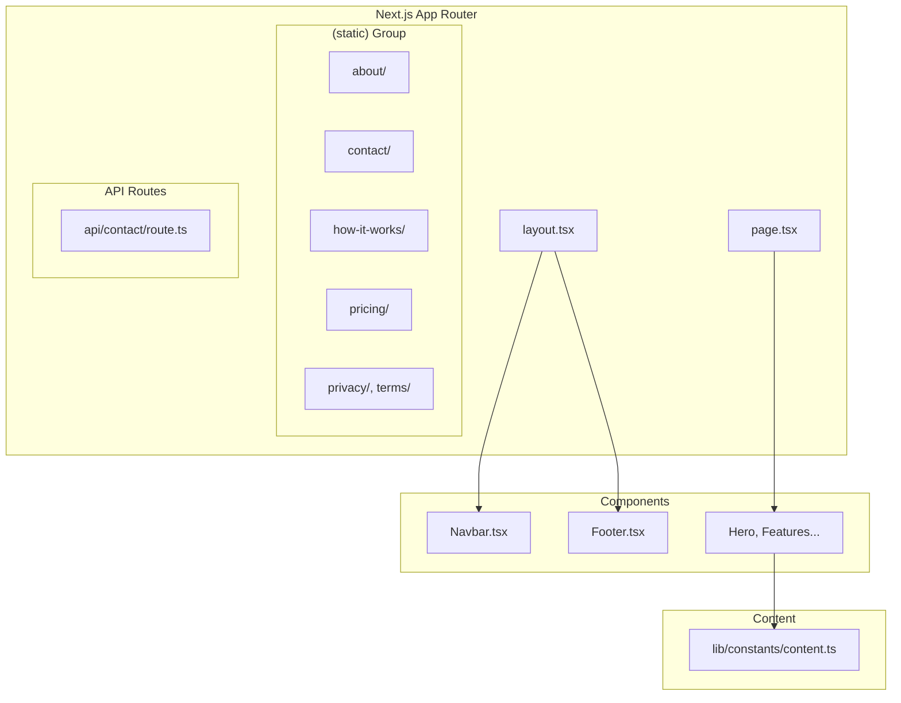

## Overview

<Info>
**Project:** vritti-landing
**Framework:** Next.js 15
**Type:** Marketing Website
**Port:** 3000 (Next.js default)
</Info>

vritti-landing is the public-facing marketing website for Vritti AI. It showcases the product, pricing, and company information using Next.js 15 with the App Router.

## What It Does

- Presents Vritti AI product features and benefits
- Showcases pricing and target industries
- Provides contact form for lead generation
- Displays company information (about, mission, terms, privacy)
- Optimized for SEO with structured data

## Tech Stack

| Technology | Version | Purpose |
|------------|---------|---------|
| Next.js | 15.3.3 | Full-stack React framework |
| React | 19.0.0 | UI library |
| TypeScript | 5.x | Type safety |
| @vritti/quantum-ui | 0.1.21 | Design system |
| @mui/material | 7.1.1 | Base components |
| Tailwind CSS | 3.4.x | Utility styling |
| next-seo | 6.8.0 | SEO optimization |

## Site Structure

```
vritti-landing/
├── / (Home)
│   ├── Hero Section
│   ├── Pain Points
│   ├── Solution Overview
│   ├── Industry Cards
│   └── CTA Section
├── /about
├── /contact
├── /how-it-works
├── /mission-vision
├── /pricing
├── /privacy
└── /terms
```

## Architecture



## Project Structure

```
vritti-landing/
├── src/
│   ├── app/
│   │   ├── (static)/              # Static page group
│   │   │   ├── about/
│   │   │   ├── contact/
│   │   │   ├── how-it-works/
│   │   │   ├── mission-vision/
│   │   │   ├── pricing/
│   │   │   ├── privacy/
│   │   │   └── terms/
│   │   ├── api/
│   │   │   └── contact/route.ts   # Contact form API
│   │   ├── layout.tsx
│   │   ├── page.tsx               # Home page
│   │   └── providers.tsx
│   ├── components/
│   │   ├── layout/
│   │   │   ├── Navbar.tsx
│   │   │   ├── Footer.tsx
│   │   │   └── MobileMenu.tsx
│   │   ├── sections/
│   │   │   ├── Hero.tsx
│   │   │   ├── PainPoints.tsx
│   │   │   ├── SolutionOverview.tsx
│   │   │   ├── IndustryCards.tsx
│   │   │   └── CTASection.tsx
│   │   ├── ui/
│   │   │   ├── Animated.tsx
│   │   │   └── GradientText.tsx
│   │   └── providers/
│   │       └── AnimationProvider.tsx
│   ├── lib/
│   │   ├── constants/
│   │   │   └── content.ts         # All static content
│   │   ├── hooks/
│   │   │   └── useScrollAnimation.ts
│   │   └── utils/
│   │       └── css-animations.ts
│   └── styles/
│       └── globals.css
├── public/                        # Static assets
├── next.config.ts
└── package.json
```

## Home Page Sections

### Hero Section

```typescript
// Full-screen hero with gradient background
<Hero
  headline="Your AI Business Partner That Never Sleeps"
  subheadline="Transform your small business with private AI"
  ctas={[
    { label: 'Get Early Access', href: '/signup' },
    { label: 'Watch 2-Min Demo', href: '#demo' },
  ]}
  trustBar="Join 500+ businesses on the waitlist"
/>
```

### Pain Points

Addresses 6 key business frustrations:
- Customer bookings scattered across WhatsApp
- Inventory tracked manually
- No profitability insights
- Manual reporting hours
- Missing appointments
- Can't compete with tech-savvy competitors

### Solution Overview

5 feature cards:
- Smart Scheduling
- Customer Intelligence
- Inventory Tracking
- Financial Intelligence
- AI Assistant

### Industry Cards

Carousel showcasing 4 target industries:
- Salons & Spas
- Restaurants
- Clinics
- Driving Schools

### CTA Section

Final call-to-action with pricing preview:
- **$114/month** ($99 AI + ~$15 hosting)
- Additional locations: $29/month each

## Content Management

All content is managed in a single file:

```typescript
// src/lib/constants/content.ts
export const SITE_CONFIG = { ... };
export const NAVIGATION_ITEMS = [ ... ];
export const HERO_CONTENT = { ... };
export const PAIN_POINTS = [ ... ];
export const SOLUTION_FEATURES = [ ... ];
export const INDUSTRIES = [ ... ];
export const PRICING_CONTENT = { ... };
export const HOW_IT_WORKS_STEPS = [ ... ];
export const MISSION_CONTENT = { ... };
export const CONTACT_INFO = { ... };
export const FAQ_ITEMS = [ ... ];
```

<Note>
Content-as-code approach makes it easy to update copy without a CMS. Changes are versioned with the codebase.
</Note>

## Animation System

CSS-based animations using Intersection Observer:

```typescript
// components/ui/Animated.tsx
<Animated animation="fadeInUp" delay={0.2}>
  <FeatureCard title="Smart Scheduling" />
</Animated>

// Staggered animations
<Stagger staggerDelay={0.1}>
  {features.map((feature) => (
    <FeatureCard key={feature.id} {...feature} />
  ))}
</Stagger>
```

Available animations:
- `fadeInUp`, `fadeInDown`, `fadeIn`
- `scaleIn`, `slideInLeft`, `slideInRight`
- `hoverScale`, `hoverLift`, `hoverGlass`
- `pulse`, `float`, `gradientShift`

## API Routes

### Contact Form

```typescript
// POST /api/contact
export async function POST(request: Request) {
  const { name, email, company, message } = await request.json();

  // Validation
  if (!name || !email || !message) {
    return Response.json({ error: 'Missing fields' }, { status: 400 });
  }

  // TODO: Integrate with email service (Resend)
  console.log('Contact submission:', { name, email, company, message });

  return Response.json({ success: true });
}
```

## SEO Configuration

### Structured Data

```typescript
// Schema.org markup
const structuredData = {
  '@context': 'https://schema.org',
  '@type': 'SoftwareApplication',
  name: 'Vritti AI',
  applicationCategory: 'BusinessApplication',
  offers: {
    '@type': 'Offer',
    price: '114',
    priceCurrency: 'USD',
  },
};
```

### Meta Tags

- Title: "Vritti AI - AI Business Operating System for SMBs"
- Description optimized for search
- Open Graph tags for social sharing
- Twitter card configuration

## Design System Integration

Uses `@vritti/quantum-ui` components:

```typescript
import { Button } from '@vritti/quantum-ui/Button';
import { Paper } from '@vritti/quantum-ui/Paper';
import { Typography } from '@vritti/quantum-ui/Typography';

// Direct imports - no barrel exports
// Semantic variants instead of custom styling
<Paper variant="feature">
  <Typography variant="h3">Feature Title</Typography>
  <Button intent="primary">Learn More</Button>
</Paper>
```

## Performance

- CSS animations (no Framer Motion)
- Direct component imports
- Static generation where possible
- Image optimization with next/image
- Turbopack for fast dev builds

## Related Documentation

<CardGroup cols={2}>
  <Card title="Setup Guide" icon="wrench" href="/projects/landing/setup">
    Local development setup
  </Card>
  <Card title="quantum-ui" icon="palette" href="/projects/quantum-ui/overview">
    Design system components
  </Card>
</CardGroup>
