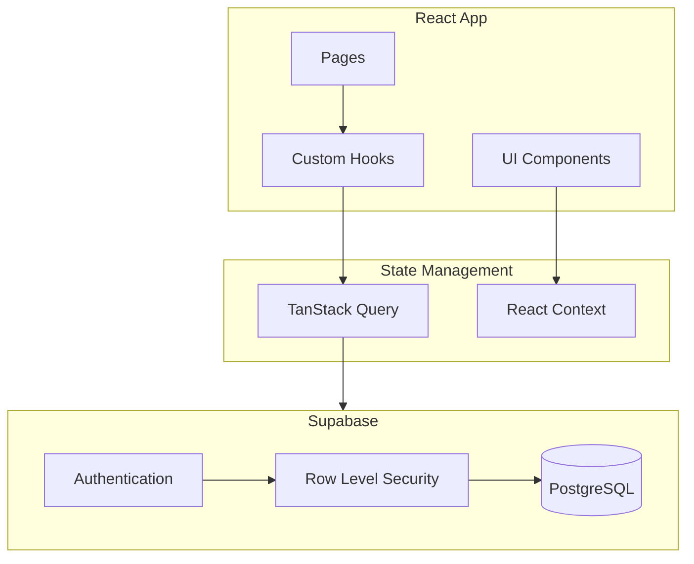

## Overview

<Info>
**Project:** slicingpie
**Framework:** Vite + React
**Backend:** Supabase
**Purpose:** Equity distribution calculator
</Info>

Slicingpie is a fair equity distribution calculator for startups implementing the "Slicing Pie" model. It helps co-founders transparently track and calculate ownership stakes based on actual contributions.

## What It Does

- Calculates fair equity distribution based on contributions
- Tracks multiple contribution types (cash, time, revenue, expenses)
- Provides real-time equity visualization
- Supports scenario forecasting
- Manages founder and category configuration

## Tech Stack

| Technology | Version | Purpose |
|------------|---------|---------|
| React | 19.2.3 | UI framework |
| Vite | 5.4.21 | Build tool |
| TypeScript | 5.9.3 | Type safety |
| Supabase | 2.91.1 | Backend & auth |
| TanStack Query | 5.90.20 | Server state |
| react-hook-form | 7.71.1 | Form handling |
| Zod | 3.25.76 | Validation |
| shadcn/ui | - | Component library |
| Recharts | 2.15.4 | Visualizations |

## Architecture



## Project Structure

```
slicingpie/
├── src/
│   ├── components/
│   │   ├── ui/                    # shadcn/ui components
│   │   ├── overview/              # Dashboard tab
│   │   │   ├── OverviewTab.tsx
│   │   │   ├── EquityPieChart.tsx
│   │   │   ├── FounderCard.tsx
│   │   │   └── SummaryCards.tsx
│   │   ├── ledger/                # Transaction tab
│   │   │   ├── LedgerTab.tsx
│   │   │   ├── AddEntryForm.tsx
│   │   │   └── EntriesTable.tsx
│   │   ├── forecast/              # Forecast tab
│   │   │   └── ForecastTab.tsx
│   │   └── settings/              # Settings tab
│   │       ├── SettingsTab.tsx
│   │       ├── FounderSettings.tsx
│   │       └── CategorySettings.tsx
│   ├── hooks/
│   │   ├── useAuth.tsx
│   │   └── useSlicingPie.ts
│   ├── pages/
│   │   ├── Index.tsx              # Main dashboard
│   │   ├── Auth.tsx               # Login page
│   │   └── NotFound.tsx
│   ├── integrations/
│   │   └── supabase/
│   │       ├── client.ts
│   │       └── types.ts
│   ├── lib/
│   │   ├── calculations.ts        # Core calculation engine
│   │   ├── constants.ts           # Default data
│   │   └── utils.ts
│   └── types/
│       └── slicingPie.ts
├── package.json
└── vite.config.ts
```

## Core Concepts

### Contribution Categories

| Category | Multiplier | Description |
|----------|------------|-------------|
| Cash | 4x | Cash invested |
| Time | 2x | Hours worked |
| Revenue | 4x (10% commission) | Revenue brought in |
| Expenses | 4x | Out-of-pocket expenses |
| Expense Received | -4x | Reimbursements (admin only) |
| Intellectual Property | % based | IP contributions (admin only) |

### Slice Calculation

```typescript
// Core calculation engine
function calculateFounderSlices(founder, entries, categories) {
  // Time-based slices
  const hourlyGap = (marketSalary - paidSalary) / 189;
  const timeSlices = hoursWorked * hourlyGap * multiplier;

  // Cash slices
  const cashSlices = cashAmount * multiplier;

  // Revenue slices
  const revenueSlices = revenue * commissionPercent * multiplier;

  // Expense slices
  const expenseSlices = expenses * multiplier;

  return {
    timeSlices,
    cashSlices,
    revenueSlices,
    expenseSlices,
    totalSlices: sum(all),
  };
}
```

## Application Tabs

### Overview Tab

- **Summary Cards**: Total slices, founders, cash, entries
- **Equity Pie Chart**: Visual distribution
- **Founder Cards**: Detailed breakdown per founder

### Ledger Tab

- **Add Entry Form**: Record new contributions
- **Entries Table**: Historical transactions
- **Filters**: By founder, category, date

### Forecast Tab

- **Scenario Planning**: Hypothetical contributions
- **Real-time Calculation**: Projected equity
- **Comparison View**: Current vs projected

### Settings Tab (Admin)

- **Founder Settings**: Add/edit/remove founders
- **Category Settings**: Configure multipliers
- **User Management**: Roles and permissions

## Data Models

### Founder

```typescript
interface Founder {
  id: string;
  name: string;
  marketSalary: number;    // Monthly market rate in ₹
  paidSalary: number;      // Monthly actual paid salary in ₹
}
```

### Ledger Entry

```typescript
interface LedgerEntry {
  id: string;
  founderId: string;
  categoryId: CategoryId;
  amount: number;
  date: Date;
  description: string;
  founderSnapshot: Founder;    // At time of entry
  categorySnapshot: Category;  // At time of entry
  createdBy: string;
}
```

### Calculations

```typescript
interface FounderCalculations {
  founderId: string;
  hoursWorked: number;
  workingMonths: number;
  hourlyMarketRate: number;
  hourlyPaidRate: number;
  hourlyGap: number;
  cashInvested: number;
  salaryGapValue: number;
  revenue: number;
  expenses: number;
  ipTotal: number;
  totalSlices: number;
  categoryBreakdowns: CategoryBreakdown[];
}
```

## Authentication

- Supabase Auth with email/password
- First user becomes admin
- Subsequent users are members
- Role-based access control via RLS

```typescript
// useAuth.tsx
const { user, isAdmin, signIn, signOut } = useAuth();

if (!isAdmin) {
  // Hide admin-only features
}
```

## Database Schema

```sql
-- Founders table
CREATE TABLE founders (
  id UUID PRIMARY KEY,
  name TEXT NOT NULL,
  market_salary NUMERIC NOT NULL,
  paid_salary NUMERIC NOT NULL,
  created_at TIMESTAMP DEFAULT NOW()
);

-- Ledger entries table
CREATE TABLE ledger_entries (
  id UUID PRIMARY KEY,
  founder_id UUID REFERENCES founders(id),
  category_id TEXT NOT NULL,
  amount NUMERIC NOT NULL,
  date DATE NOT NULL,
  description TEXT,
  founder_snapshot JSONB,
  category_snapshot JSONB,
  created_by UUID REFERENCES auth.users(id),
  created_at TIMESTAMP DEFAULT NOW()
);

-- Row Level Security
ALTER TABLE ledger_entries ENABLE ROW LEVEL SECURITY;

CREATE POLICY "Users can view all entries"
  ON ledger_entries FOR SELECT
  TO authenticated
  USING (true);

CREATE POLICY "Users can delete own entries"
  ON ledger_entries FOR DELETE
  TO authenticated
  USING (created_by = auth.uid());
```

## Key Features

<CardGroup cols={2}>
  <Card title="Fair Distribution" icon="scale-balanced">
    Transparent equity based on contributions
  </Card>
  <Card title="Real-time Calculation" icon="calculator">
    Instant updates on equity changes
  </Card>
  <Card title="Historical Tracking" icon="clock-rotate-left">
    Full audit trail with snapshots
  </Card>
  <Card title="Scenario Planning" icon="chart-line">
    Forecast future equity scenarios
  </Card>
</CardGroup>

## Role Permissions

| Action | Admin | Member |
|--------|-------|--------|
| View all data | ✓ | ✓ |
| Add entries | ✓ | ✓ (except admin categories) |
| Delete own entries | ✓ | ✓ |
| Delete any entry | ✓ | ✗ |
| Manage founders | ✓ | ✗ |
| Configure categories | ✓ | ✗ |

## Related Documentation

<CardGroup cols={2}>
  <Card title="Setup Guide" icon="wrench" href="/projects/slicingpie/setup">
    Local development setup
  </Card>
  <Card title="Supabase" icon="database" href="https://supabase.com/docs">
    Backend documentation
  </Card>
</CardGroup>
