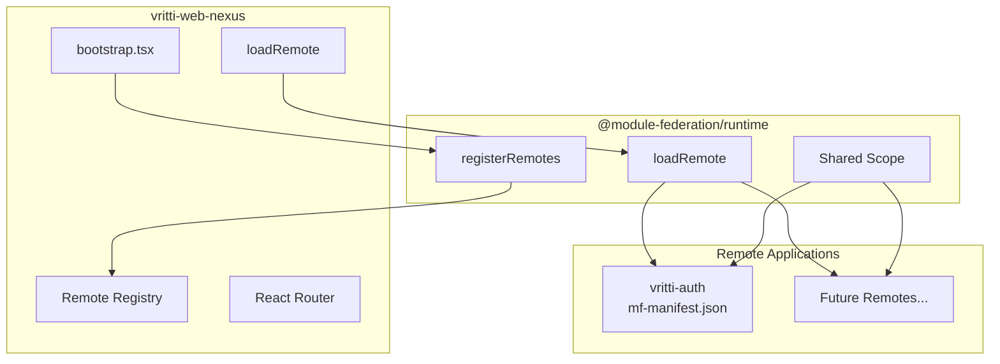

## Overview

vritti-web-nexus uses Module Federation 2.0 with runtime registration to dynamically load micro-frontends. This enables adding new remotes without rebuilding the host.

## Architecture



## Rsbuild Configuration

The host configuration in `rsbuild.config.ts`:

```typescript
import { pluginModuleFederation } from '@module-federation/rsbuild-plugin';

export default defineConfig({
  plugins: [
    pluginModuleFederation({
      name: 'vritti_nexus_host',
      remotes: {
        // Runtime registration - no build-time remotes
      },
      shared: {
        react: {
          singleton: true,
          requiredVersion: '^19.2.0',
          eager: true,
        },
        'react-dom': {
          singleton: true,
          requiredVersion: '^19.2.0',
          eager: true,
        },
        'react-router-dom': {
          singleton: true,
          eager: true,
        },
        '@vritti/quantum-ui': {
          singleton: true,
          eager: true,
        },
        axios: {
          singleton: true,
          eager: true,
        },
        '@tanstack/react-query': {
          singleton: true,
          eager: true,
        },
      },
    }),
  ],
});
```

## Runtime Registration

### Remote Configuration

Define remotes in `src/config/remotes.config.ts`:

```typescript
export interface RemoteConfig {
  name: string;
  entry: string;
  exposedModule: string;
}

export const ALL_REMOTES: RemoteConfig[] = [
  {
    name: 'VrittiAuth',
    entry: process.env.PUBLIC_VRITTI_AUTH_ENTRY ||
           'http://local.vrittiai.com:3001/mf-manifest.json',
    exposedModule: 'routes',
  },
  // Add future remotes here
];
```

### Bootstrap Registration

Register remotes before rendering in `src/bootstrap.tsx`:

```typescript
import { registerRemotes } from '@module-federation/runtime';
import { ALL_REMOTES } from './config/remotes.config';

// Configure quantum-ui first (session recovery)
configureQuantumUI(quantumUIConfig);

// Register all remotes
registerRemotes(
  ALL_REMOTES.map((remote) => ({
    name: remote.name,
    entry: remote.entry,
  }))
);

// Now render the app
const root = createRoot(document.getElementById('root')!);
root.render(<App />);
```

## Loading Remote Modules

### RemoteRoutes Component

The `src/utils/RemoteRoutes.tsx` component handles dynamic loading:

```typescript
import { loadRemote } from '@module-federation/runtime';

const moduleCache = new Map<string, unknown>();

async function loadRemoteModule(remoteName: string, moduleName: string) {
  const cacheKey = `${remoteName}/${moduleName}`;

  if (moduleCache.has(cacheKey)) {
    return moduleCache.get(cacheKey);
  }

  const module = await loadRemote(`${remoteName}/${moduleName}`);
  const result = module.default || module;

  moduleCache.set(cacheKey, result);
  return result;
}

export function RemoteRoutes({
  remoteName,
  moduleName,
  dataKey
}: RemoteRoutesProps) {
  const [routes, setRoutes] = useState<RouteObject[] | null>(null);
  const [error, setError] = useState<Error | null>(null);

  useEffect(() => {
    loadRemoteModule(remoteName, moduleName)
      .then((module) => {
        // Extract routes using dataKey if provided
        const routeData = dataKey ? module[dataKey] : module;
        setRoutes(routeData);
      })
      .catch(setError);
  }, [remoteName, moduleName, dataKey]);

  if (error) return <ErrorFallback error={error} />;
  if (!routes) return <LoadingSkeleton />;

  return <>{useRoutes(routes)}</>;
}
```

### Usage in Routes

```typescript
// src/routes.tsx
const isCloud = window.location.hostname.startsWith('cloud.');

export const routes: RouteObject[] = [
  { path: '/', element: <LoadingPage /> },
];

if (isCloud) {
  routes.push({
    path: '/*',
    element: (
      <RemoteRoutes
        remoteName="VrittiAuth"
        moduleName="routes"
        dataKey="authRoutes"
      />
    ),
  });
}
```

## Shared Dependencies

### Singleton Strategy

Critical dependencies are shared as singletons to ensure only one instance exists:

| Dependency | Why Singleton? |
|------------|----------------|
| `react` | React context requires single instance |
| `react-dom` | DOM reconciliation |
| `react-router-dom` | Router context sharing |
| `@tanstack/react-query` | Shared query cache |
| `@vritti/quantum-ui` | Design system consistency |
| `axios` | Interceptor configuration |

### Eager Loading

Setting `eager: true` means the host loads these dependencies immediately rather than waiting for a remote to request them:

```typescript
shared: {
  react: {
    singleton: true,
    eager: true,  // Load immediately with host
  },
}
```

## Module Federation Manifest

Each remote exposes an `mf-manifest.json` file:

```json
{
  "id": "vritti_auth",
  "name": "vritti_auth",
  "metaData": {
    "name": "vritti_auth",
    "type": "app",
    "buildInfo": {
      "buildVersion": "1.0.0"
    },
    "remoteEntry": {
      "name": "vritti_auth.js",
      "path": "static/js/vritti_auth.js"
    },
    "publicPath": "http://local.vrittiai.com:3001/"
  },
  "exposes": [
    {
      "id": "vritti_auth:routes",
      "name": "./routes",
      "path": "./src/routes.tsx",
      "assets": { ... }
    }
  ],
  "shared": [ ... ]
}
```

## Error Handling

### Load Failures

Handle module load failures gracefully:

```typescript
function RemoteRoutes({ remoteName, moduleName }: Props) {
  const [error, setError] = useState<Error | null>(null);

  if (error) {
    return (
      <div className="error-container">
        <h2>Failed to load {remoteName}</h2>
        <p>{error.message}</p>
        <Button onClick={() => window.location.reload()}>
          Retry
        </Button>
      </div>
    );
  }

  // ... rest of component
}
```

### Version Mismatches

If shared dependency versions don't match:

```typescript
shared: {
  react: {
    singleton: true,
    strictVersion: true,  // Throw error on mismatch
    requiredVersion: '^19.2.0',
  },
}
```

## Adding New Remotes

### Step 1: Create Remote Configuration

```typescript
// remotes.config.ts
export const ALL_REMOTES: RemoteConfig[] = [
  // Existing
  {
    name: 'VrittiAuth',
    entry: 'http://local.vrittiai.com:3001/mf-manifest.json',
    exposedModule: 'routes',
  },
  // New remote
  {
    name: 'VrittiDashboard',
    entry: 'http://local.vrittiai.com:3003/mf-manifest.json',
    exposedModule: 'routes',
  },
];
```

### Step 2: Add Routes

```typescript
// routes.tsx
if (isCloud) {
  routes.push(
    {
      path: '/auth/*',
      element: <RemoteRoutes remoteName="VrittiAuth" moduleName="routes" />,
    },
    {
      path: '/dashboard/*',
      element: <RemoteRoutes remoteName="VrittiDashboard" moduleName="routes" />,
    }
  );
}
```

### Step 3: Configure Remote

The remote must expose its routes:

```typescript
// Remote's rsbuild.config.ts
pluginModuleFederation({
  name: 'vritti_dashboard',
  exposes: {
    './routes': './src/routes.tsx',
  },
  shared: {
    // Same shared config as host
  },
})
```

## Performance Considerations

### Caching

Modules are cached after first load:

```typescript
const moduleCache = new Map<string, unknown>();

// Subsequent loads hit cache
if (moduleCache.has(cacheKey)) {
  return moduleCache.get(cacheKey);
}
```

### Loading State

Show skeleton while loading:

```typescript
<Suspense fallback={<MicrofrontendSkeletonFullPage />}>
  <RemoteRoutes ... />
</Suspense>
```

### Minimum Display Time

Prevent flash of loading state:

```typescript
// Wait at least 500ms to show content
await Promise.all([
  loadRemoteModule(remoteName, moduleName),
  new Promise(resolve => setTimeout(resolve, 500)),
]);
```

## Debugging

### Console Logging

Enable verbose logging:

```typescript
console.log(`[MF] Loading: ${remoteName}/${moduleName}`);
console.log(`[MF] Loaded:`, module);
console.log(`[MF] Routes:`, extractedRoutes);
```

### Network Tab

Check for:
- `mf-manifest.json` loaded successfully
- Remote entry JS file loaded
- No 404 errors on chunks

### React DevTools

Verify shared contexts are the same instance across host and remotes.

## Related Documentation

<CardGroup cols={2}>
  <Card title="Web Nexus Overview" icon="house" href="/projects/web-nexus/overview">
    Project overview
  </Card>
  <Card title="vritti-auth" icon="user-lock" href="/projects/auth/overview">
    Auth remote configuration
  </Card>
  <Card title="Module Federation" icon="cubes" href="/architecture/frontend/module-federation">
    Architecture documentation
  </Card>
  <Card title="Micro-frontends" icon="puzzle-piece" href="/architecture/frontend/micro-frontends">
    Micro-frontend patterns
  </Card>
</CardGroup>
