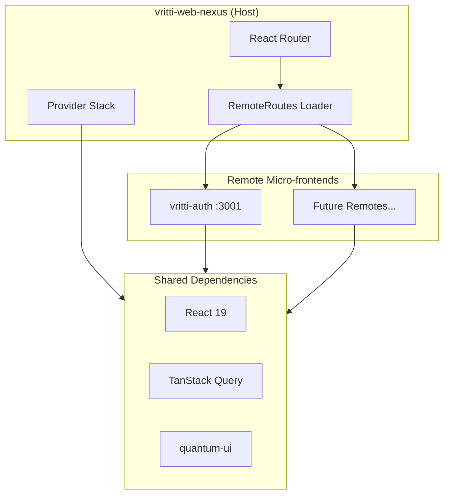

## Overview

<Info>
**Project:** vritti-web-nexus
**Type:** Host Application (Module Federation)
**Port:** 3012
**Host:** local.vrittiai.com
</Info>

vritti-web-nexus is the main host application in Vritti's micro-frontend architecture. It orchestrates and dynamically loads remote micro-frontends (like vritti-auth) using Module Federation with runtime registration.

## What It Does

- Serves as the Module Federation host that loads remote micro-frontends
- Provides shared dependencies (React, React Router, TanStack Query)
- Manages routing and subdomain-based feature toggling
- Handles session recovery and CSRF protection via quantum-ui
- Provides consistent theming and design system across all remotes

## Tech Stack

| Technology | Version | Purpose |
|------------|---------|---------|
| React | 19.2.0 | UI framework |
| Rsbuild | 1.7.x | Rust-based bundler with Rspack |
| Module Federation | 0.22.1 | Micro-frontend orchestration |
| React Router | 7.x | Client-side routing |
| TanStack Query | 5.x | Server state management |
| Tailwind CSS | 4.x | Utility-first styling |
| @vritti/quantum-ui | 0.2.7 | Design system components |

## Architecture



## Project Structure

```
vritti-web-nexus/
├── src/
│   ├── index.tsx              # Dynamic bootstrap loader
│   ├── bootstrap.tsx          # Main entry with remote registration
│   ├── App.tsx                # Root component with providers
│   ├── routes.tsx             # Route configuration
│   ├── config/
│   │   └── remotes.config.ts  # Remote registry
│   ├── utils/
│   │   ├── RemoteRoutes.tsx   # Dynamic remote loading
│   │   └── MircrofrontendFullPageSkeleton.tsx
│   └── pages/
│       └── Loading.tsx
├── rsbuild.config.ts          # Build & MF configuration
├── quantum-ui.config.ts       # Design system config
└── package.json
```

## Key Features

### Runtime Module Registration

Unlike build-time module federation, vritti-web-nexus uses runtime registration:

```typescript
// bootstrap.tsx
import { registerRemotes } from '@module-federation/runtime';

registerRemotes([
  {
    name: 'VrittiAuth',
    entry: 'http://local.vrittiai.com:3001/mf-manifest.json',
  },
]);
```

This allows adding new remotes without rebuilding the host.

### Subdomain-Based Routing

Routes are loaded based on the current subdomain:

```typescript
// routes.tsx
const isCloud = window.location.hostname.startsWith('cloud.');

if (isCloud) {
  routes.push({
    path: '/*',
    element: <RemoteRoutes remoteName="VrittiAuth" moduleName="routes" />,
  });
}
```

### Provider Stack

The host wraps all content with essential providers:

```typescript
// App.tsx
<QueryClientProvider client={queryClient}>
  <BrowserRouter>
    <Toaster />
    <AppRoutes />
  </BrowserRouter>
</QueryClientProvider>
```

## Remote Configuration

Remotes are defined in `src/config/remotes.config.ts`:

```typescript
export const ALL_REMOTES: RemoteConfig[] = [
  {
    name: 'VrittiAuth',
    entry: process.env.PUBLIC_VRITTI_AUTH_ENTRY ||
           'http://local.vrittiai.com:3001/mf-manifest.json',
    exposedModule: 'routes',
  },
];
```

## Shared Dependencies

The host provides singleton versions of core libraries:

| Dependency | Strategy | Purpose |
|------------|----------|---------|
| `react` | Singleton, Eager | UI framework |
| `react-dom` | Singleton, Eager | DOM rendering |
| `react-router-dom` | Singleton | Routing |
| `@vritti/quantum-ui` | Singleton | Design system |
| `axios` | Singleton | HTTP client |
| `@tanstack/react-query` | Singleton | Server state |

## quantum-ui Configuration

The host configures quantum-ui before rendering:

```typescript
// quantum-ui.config.ts
export default {
  csrf: {
    endpoint: '/csrf/token',
    enabled: true,
    headerName: 'x-csrf-token',
  },
  axios: {
    baseURL: '/api',
    timeout: 30000,
    withCredentials: true,
  },
  auth: {
    tokenEndpoint: 'cloud-api/auth/token',
    refreshEndpoint: 'cloud-api/auth/refresh',
    sessionRecoveryEnabled: true,
  },
};
```

## Development Modes

| Mode | Command | URL |
|------|---------|-----|
| Standard | `pnpm dev` | http://local.vrittiai.com:3012 |
| SSL | `pnpm dev:ssl` | https://local.vrittiai.com:3012 |
| Cloud | `pnpm dev:cloud` | http://cloud.local.vrittiai.com:3012 |
| Cloud SSL | `pnpm dev:cloud-ssl` | https://cloud.local.vrittiai.com:3012 |

## Related Documentation

<CardGroup cols={2}>
  <Card title="Setup Guide" icon="wrench" href="/projects/web-nexus/setup">
    Local development setup
  </Card>
  <Card title="Federation Host" icon="sitemap" href="/projects/web-nexus/federation-host">
    Module Federation configuration
  </Card>
  <Card title="vritti-auth" icon="user-lock" href="/projects/auth/overview">
    Authentication micro-frontend
  </Card>
  <Card title="Module Federation" icon="cubes" href="/architecture/frontend/module-federation">
    Architecture overview
  </Card>
</CardGroup>
