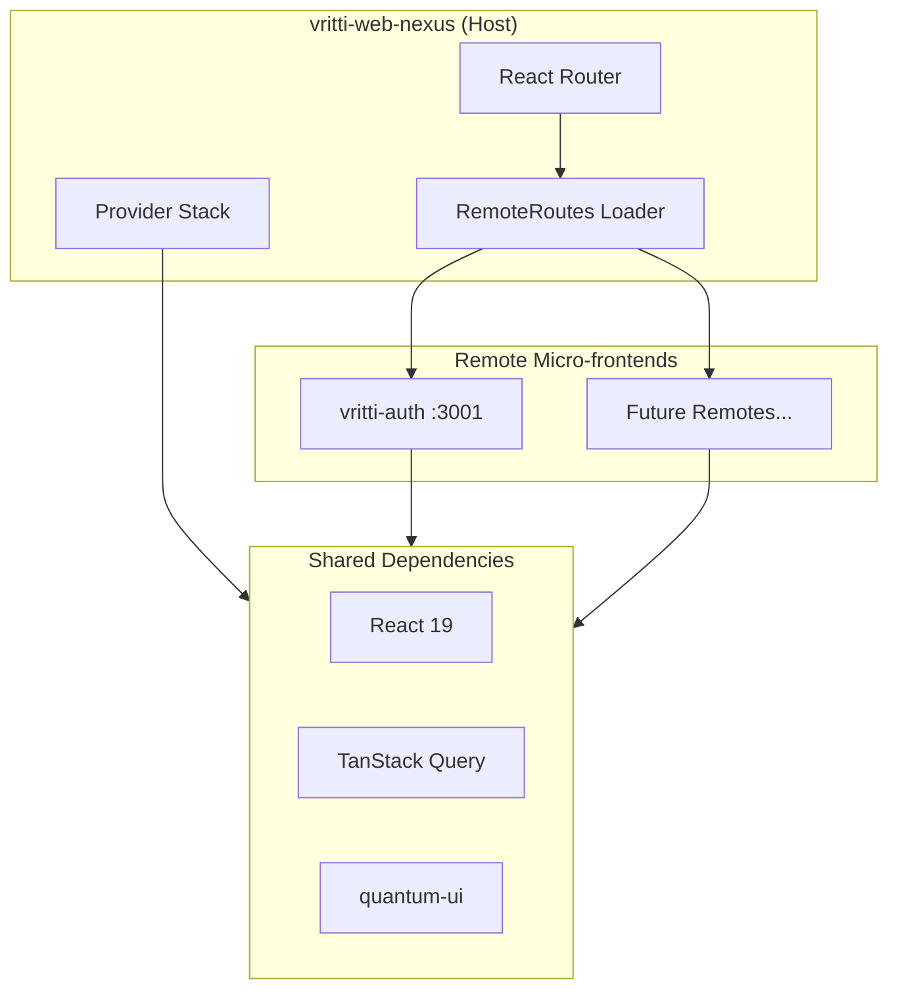

<Info>
**Project:** vritti-web-nexus
**Type:** Host Application (Module Federation)
**Port:** 3012
**Host:** local.vrittiai.com
</Info>

vritti-web-nexus is the main host application in Vritti's micro-frontend architecture. It orchestrates and dynamically loads remote micro-frontends (like vritti-auth) using Module Federation with runtime registration.

## What It Does

- Serves as the Module Federation host that loads remote micro-frontends
- Provides shared dependencies (React, React Router, TanStack Query)
- Manages routing and subdomain-based feature toggling
- Handles session recovery and CSRF protection via quantum-ui
- Provides consistent theming and design system across all remotes

## Tech Stack

| Technology | Version | Purpose |
|------------|---------|---------|
| React | 19.2.0 | UI framework |
| Rsbuild | 1.7.x | Rust-based bundler with Rspack |
| Module Federation | 0.22.1 | Micro-frontend orchestration |
| React Router | 7.x | Client-side routing |
| TanStack Query | 5.x | Server state management |
| Tailwind CSS | 4.x | Utility-first styling |
| @vritti/quantum-ui | 0.2.7 | Design system components |

## Architecture



## Project Structure

```
vritti-web-nexus/
├── src/
│   ├── index.tsx              # Dynamic bootstrap loader
│   ├── bootstrap.tsx          # Main entry with remote registration
│   ├── App.tsx                # Root component with providers
│   ├── routes.tsx             # Route configuration
│   ├── config/
│   │   └── remotes.config.ts  # Remote registry
│   ├── utils/
│   │   ├── RemoteRoutes.tsx   # Dynamic remote loading
│   │   └── MircrofrontendFullPageSkeleton.tsx
│   └── pages/
│       └── Loading.tsx
├── rsbuild.config.ts          # Build & MF configuration
├── quantum-ui.config.ts       # Design system config
└── package.json
```

## Environment Variables

<Warning>
Rsbuild requires the `PUBLIC_` prefix for environment variables to be accessible in browser code.
</Warning>

Environment variables are exposed via `import.meta.env` (not `process.env`):

| Variable | Type | Purpose | Example |
|----------|------|---------|---------|
| `PUBLIC_VRITTI_AUTH_PORT` | string | Auth remote port (local dev) | `3001` |
| `PUBLIC_VRITTI_CLOUD_PORT` | string | Cloud remote port (local dev) | `3002` |
| `PUBLIC_MF_BASE_URL` | string | MF base URL (production) | `https://mf.vrittiai.com` |

### Type Declarations

Type declarations are in `src/env.d.ts`:

```typescript
interface ImportMetaEnv {
  // Module Federation remote ports (local development)
  readonly PUBLIC_VRITTI_AUTH_PORT?: string;
  readonly PUBLIC_VRITTI_CLOUD_PORT?: string;

  // Module Federation base URL (production)
  readonly PUBLIC_MF_BASE_URL?: string;
}

interface ImportMeta {
  readonly env: ImportMetaEnv;
}
```

### Type-Safe Access

For dynamic key access, use a helper function:

```typescript
const getEnvVar = (key: string): string | undefined => {
  return (import.meta.env as Record<string, string | undefined>)[key];
};

// Usage
const authPort = getEnvVar('PUBLIC_VRITTI_AUTH_PORT');
```

## Key Features

### Runtime Module Registration

Unlike build-time module federation, vritti-web-nexus uses runtime registration:

```typescript
// bootstrap.tsx
import { registerRemotes } from '@module-federation/runtime';

registerRemotes([
  {
    name: 'VrittiAuth',
    entry: 'http://local.vrittiai.com:3001/mf-manifest.json',
  },
]);
```

This allows adding new remotes without rebuilding the host.

### Subdomain-Based Routing

Routes are loaded based on the current subdomain:

```typescript
// routes.tsx
const isCloud = window.location.hostname.startsWith('cloud.');

if (isCloud) {
  routes.push({
    path: '/*',
    element: <RemoteRoutes remoteName="VrittiAuth" moduleName="routes" />,
  });
}
```

### Provider Stack

The host wraps all content with essential providers:

```typescript
// App.tsx
<QueryClientProvider client={queryClient}>
  <BrowserRouter>
    <Toaster />
    <AppRoutes />
  </BrowserRouter>
</QueryClientProvider>
```

## Remote Configuration

Remotes are defined in `src/config/remotes.config.ts` with environment-driven URLs:

```typescript
/**
 * Builds the remote entry URL based on environment variables
 * - Local mode: Uses PUBLIC_*_PORT for port-based routing
 * - Production mode: Uses PUBLIC_MF_BASE_URL for path-based routing
 */
const buildRemoteEntry = (config: {
  portEnvVar: string;    // e.g., 'PUBLIC_VRITTI_AUTH_PORT'
  prodPath: string;      // e.g., 'auth-microfrontend'
}): string => {
  const { protocol, host } = getEnvironmentConfig();

  // Check if port environment variable is defined
  const remotePort = getEnvVar(config.portEnvVar);

  if (remotePort) {
    // Local: port-based routing
    return `${protocol}://${host}:${remotePort}/mf-manifest.json`;
  } else {
    // Production: path-based routing
    const mfBaseUrl = import.meta.env.PUBLIC_MF_BASE_URL || `${protocol}://${host}`;
    return `${mfBaseUrl}/${config.prodPath}/mf-manifest.json`;
  }
};

export const ALL_REMOTES: RemoteConfig[] = [
  {
    name: 'VrittiAuth',
    entry: buildRemoteEntry({
      portEnvVar: 'PUBLIC_VRITTI_AUTH_PORT',
      prodPath: 'auth-microfrontend',
    }),
    exposedModule: 'routes',
  },
];
```

<Info>
**Local example**: With `PUBLIC_VRITTI_AUTH_PORT=3001` → `https://local.vrittiai.com:3001/mf-manifest.json`

**Production example**: With `PUBLIC_MF_BASE_URL=https://mf.vrittiai.com` → `https://mf.vrittiai.com/auth-microfrontend/mf-manifest.json`
</Info>

### Configuration Best Practices

<Steps>
  <Step title="Dynamic Protocol Detection">
    Auto-detect HTTP/HTTPS from `window.location.protocol` instead of hardcoding
  </Step>
  <Step title="Environment-Based Routing">
    - **Local mode**: Port-based routing when `PUBLIC_*_PORT` is defined
    - **Production mode**: Path-based routing when `PUBLIC_MF_BASE_URL` is defined
  </Step>
  <Step title="Type-Safe Access">
    Use `getEnvVar()` helper for dynamic environment variable access
  </Step>
  <Step title="SSR-Safe Fallbacks">
    Handle `window` being undefined during build with fallback values
  </Step>
</Steps>

**Key Benefits**:
- No hardcoded protocols or hosts
- Seamless transition between local and production
- Automatic HTTPS support based on host protocol
- Type-safe environment variable access

## Shared Dependencies

The host provides singleton versions of core libraries:

| Dependency | Strategy | Purpose |
|------------|----------|---------|
| `react` | Singleton, Eager | UI framework |
| `react-dom` | Singleton, Eager | DOM rendering |
| `react-router-dom` | Singleton | Routing |
| `@vritti/quantum-ui` | Singleton | Design system |
| `axios` | Singleton | HTTP client |
| `@tanstack/react-query` | Singleton | Server state |

## quantum-ui Configuration

The host configures quantum-ui before rendering:

```typescript
// quantum-ui.config.ts
export default {
  csrf: {
    endpoint: '/csrf/token',
    enabled: true,
    headerName: 'x-csrf-token',
  },
  axios: {
    baseURL: '/api',
    timeout: 30000,
    withCredentials: true,
  },
  auth: {
    tokenEndpoint: 'cloud-api/auth/token',
    refreshEndpoint: 'cloud-api/auth/refresh',
    sessionRecoveryEnabled: true,
  },
};
```

## Development Modes

| Mode | Command | URL |
|------|---------|-----|
| Standard | `pnpm dev` | http://local.vrittiai.com:3012 |
| SSL | `pnpm dev:ssl` | https://local.vrittiai.com:3012 |
| Cloud | `pnpm dev:cloud` | http://cloud.local.vrittiai.com:3012 |
| Cloud SSL | `pnpm dev:cloud-ssl` | https://cloud.local.vrittiai.com:3012 |

## Related Documentation

<CardGroup cols={2}>
  <Card title="Setup Guide" icon="wrench" href="/projects/web-nexus/setup">
    Local development setup
  </Card>
  <Card title="Federation Host" icon="sitemap" href="/projects/web-nexus/federation-host">
    Module Federation configuration
  </Card>
  <Card title="vritti-auth" icon="user-lock" href="/projects/auth/overview">
    Authentication micro-frontend
  </Card>
  <Card title="Module Federation" icon="cubes" href="/architecture/frontend/module-federation">
    Architecture overview
  </Card>
</CardGroup>
