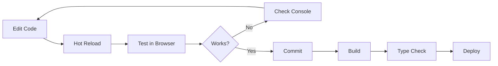

## Prerequisites

Before setting up vritti-web-nexus, ensure you have:

<CardGroup cols={2}>
  <Card title="Node.js 20+" icon="node-js">
    Required runtime version
  </Card>
  <Card title="pnpm 9+" icon="box">
    Package manager
  </Card>
  <Card title="SSL Certificates" icon="lock">
    For HTTPS local development
  </Card>
  <Card title="Hosts File Entry" icon="server">
    Custom domain mapping
  </Card>
</CardGroup>

## Step 1: Clone and Install

```bash
# Clone the repository
git clone <repository-url> vritti-web-nexus
cd vritti-web-nexus

# Install dependencies
pnpm install
```

## Step 2: Configure Hosts File

Add the following entries to your hosts file:

<Tabs>
  <Tab title="macOS/Linux">
    Edit `/etc/hosts`:
    ```bash
    sudo nano /etc/hosts
    ```
    Add:
    ```
    127.0.0.1 local.vrittiai.com
    127.0.0.1 cloud.local.vrittiai.com
    ```
  </Tab>
  <Tab title="Windows">
    Edit `C:\Windows\System32\drivers\etc\hosts` as Administrator:
    ```
    127.0.0.1 local.vrittiai.com
    127.0.0.1 cloud.local.vrittiai.com
    ```
  </Tab>
</Tabs>

## Step 3: Generate SSL Certificates (Optional)

For HTTPS development, generate certificates using mkcert:

```bash
# Install mkcert (macOS)
brew install mkcert
mkcert -install

# Generate certificates
mkdir -p certs
cd certs
mkcert "local.vrittiai.com" "cloud.local.vrittiai.com" "*.local.vrittiai.com" localhost 127.0.0.1 ::1

# Rename to expected names
mv local.vrittiai.com+5.pem local.vrittiai.com+4.pem
mv local.vrittiai.com+5-key.pem local.vrittiai.com+4-key.pem
```

## Step 4: Environment Configuration

Create a `.env` file in the project root:

```bash
# API Configuration
REACT_API_HOST=http://localhost:3000

# Remote Entry Points (optional overrides)
PUBLIC_VRITTI_AUTH_ENTRY=http://local.vrittiai.com:3001/mf-manifest.json

# HTTPS Mode (optional)
USE_HTTPS=false
```

## Step 5: Start Development Server

<Tabs>
  <Tab title="Standard">
    ```bash
    pnpm dev
    ```
    Access at: http://local.vrittiai.com:3012
  </Tab>
  <Tab title="HTTPS">
    ```bash
    pnpm dev:ssl
    ```
    Access at: https://local.vrittiai.com:3012
  </Tab>
  <Tab title="Cloud Mode">
    ```bash
    pnpm dev:cloud
    ```
    Access at: http://cloud.local.vrittiai.com:3012
  </Tab>
</Tabs>

## Running with Remotes

To see the full application with auth pages, start vritti-auth first:

```bash
# Terminal 1: Start auth remote
cd ../vritti-auth
pnpm dev

# Terminal 2: Start host
cd ../vritti-web-nexus
pnpm dev:cloud
```

The host will automatically load auth routes from the remote.

## Available Scripts

| Script | Command | Description |
|--------|---------|-------------|
| `dev` | `pnpm dev` | Start dev server on :3012 |
| `dev:ssl` | `pnpm dev:ssl` | Start with HTTPS |
| `dev:cloud` | `pnpm dev:cloud` | Start on cloud subdomain |
| `dev:cloud-ssl` | `pnpm dev:cloud-ssl` | Cloud + HTTPS |
| `build` | `pnpm build` | Production build |
| `preview` | `pnpm preview` | Preview production build |
| `lint` | `pnpm lint` | Run Biome linting |
| `format` | `pnpm format` | Format code |
| `check` | `pnpm check` | Full code quality check |

## Build Configuration

The `rsbuild.config.ts` configures:

### Server Settings

```typescript
server: {
  port: 3012,
  host: 'local.vrittiai.com',
  https: process.env.USE_HTTPS === 'true' ? {
    key: './certs/local.vrittiai.com+4-key.pem',
    cert: './certs/local.vrittiai.com+4.pem',
  } : undefined,
}
```

### API Proxy

```typescript
proxy: {
  '/api': {
    target: process.env.REACT_API_HOST || 'http://localhost:3000',
    changeOrigin: true,
    pathRewrite: { '^/api': '' },
  },
}
```

## Troubleshooting

<Accordion title="Remote module not loading">
  **Symptoms:** Blank page or loading spinner stuck

  **Solutions:**
  1. Verify vritti-auth is running on port 3001
  2. Check console for network errors
  3. Verify `mf-manifest.json` is accessible
  4. Check CORS settings if using different domains
</Accordion>

<Accordion title="HTTPS certificate errors">
  **Symptoms:** Browser shows certificate warning

  **Solutions:**
  1. Run `mkcert -install` to trust the CA
  2. Regenerate certificates if expired
  3. Clear browser cache
  4. Check certificate file paths in config
</Accordion>

<Accordion title="API requests failing">
  **Symptoms:** 502 or connection refused errors

  **Solutions:**
  1. Verify vritti-api-nexus is running
  2. Check REACT_API_HOST environment variable
  3. Verify proxy configuration in rsbuild.config.ts
</Accordion>

<Accordion title="Shared dependency version mismatch">
  **Symptoms:** Multiple React instances error

  **Solutions:**
  1. Ensure host and remotes use compatible versions
  2. Check `shared` configuration in both configs
  3. Use `singleton: true` for critical dependencies
</Accordion>

## Development Workflow



## IDE Setup

### VSCode Extensions

- ESLint / Biome
- Tailwind CSS IntelliSense
- TypeScript Importer
- Pretty TypeScript Errors

### Settings

```json
{
  "editor.formatOnSave": true,
  "editor.defaultFormatter": "biomejs.biome",
  "typescript.preferences.importModuleSpecifier": "relative"
}
```

## Related Documentation

<CardGroup cols={2}>
  <Card title="Federation Host" icon="sitemap" href="/projects/web-nexus/federation-host">
    Module Federation configuration
  </Card>
  <Card title="Prerequisites" icon="list-check" href="/getting-started/prerequisites">
    Full prerequisites guide
  </Card>
</CardGroup>
