# Vritti Ecosystem — Complete Architecture Guide

**For the team — this document explains how everything fits together, why we made these decisions, and how things work end to end.**

---

## 1. The Big Picture

We have three products and three shared libraries. Together they form the Vritti ecosystem.

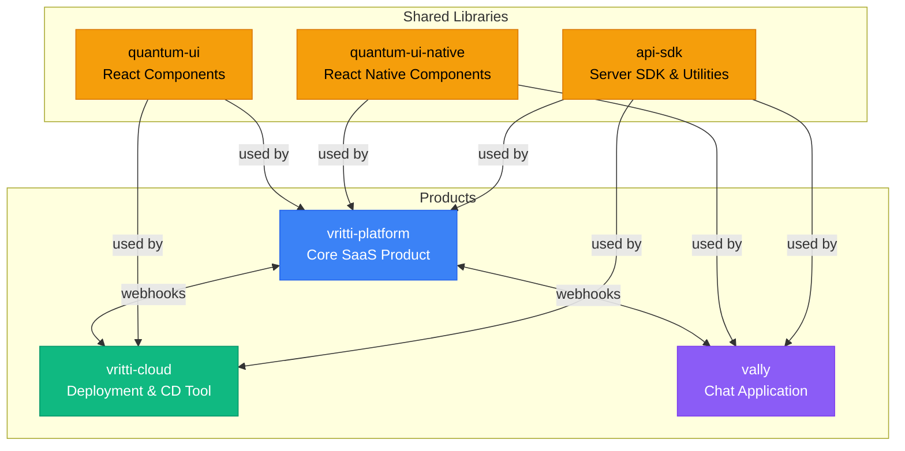
```mermaid
graph TB
    subgraph products["Products"]
        VP[vritti-platform<br/>Core SaaS Product]
        VC[vritti-cloud<br/>Deployment & CD Tool]
        VY[vally<br/>Chat Application]
    end

    subgraph libs["Shared Libraries"]
        QUI[quantum-ui<br/>React Components]
        QUIN[quantum-ui-native<br/>React Native Components]
        SDK[api-sdk<br/>Server SDK & Utilities]
    end

    VP <-->|webhooks| VC
    VP <-->|webhooks| VY

    QUI -->|used by| VP
    QUI -->|used by| VC
    QUIN -->|used by| VP
    QUIN -->|used by| VY
    SDK -->|used by| VP
    SDK -->|used by| VC
    SDK -->|used by| VY

    style VP fill:#3b82f6,stroke:#2563eb,color:#fff
    style VC fill:#10b981,stroke:#059669,color:#fff
    style VY fill:#8b5cf6,stroke:#7c3aed,color:#fff
    style QUI fill:#f59e0b,stroke:#d97706,color:#000
    style QUIN fill:#f59e0b,stroke:#d97706,color:#000
    style SDK fill:#f59e0b,stroke:#d97706,color:#000
```

**vritti-platform** is the core product. It has a web app, a mobile app, an API gateway, and multiple microservices. This is what clients use.

**vritti-cloud** is our deployment tool. It handles the CD (continuous delivery) part — it takes the built artifacts from vritti-platform and deploys them to client environments. It has its own React dashboard and NestJS server.

**vally** is a chat application. It's a React Native app with its own NestJS server and NoSQL database (MongoDB or Cassandra). Vally's micro-frontends interact with vritti-platform's APIs through webhooks.

**The shared libraries** (quantum-ui, quantum-ui-native, api-sdk) contain common code used across all three products. More on these later.

---

## 2. How vritti-platform Is Built

vritti-platform is our most complex product. Let's break down each layer.

### 2.1 Web Application — Module Federation

The web app uses Webpack Module Federation. Instead of one massive frontend app, we have a **host shell** and multiple **micro-frontends (MFs)** that load independently at runtime.

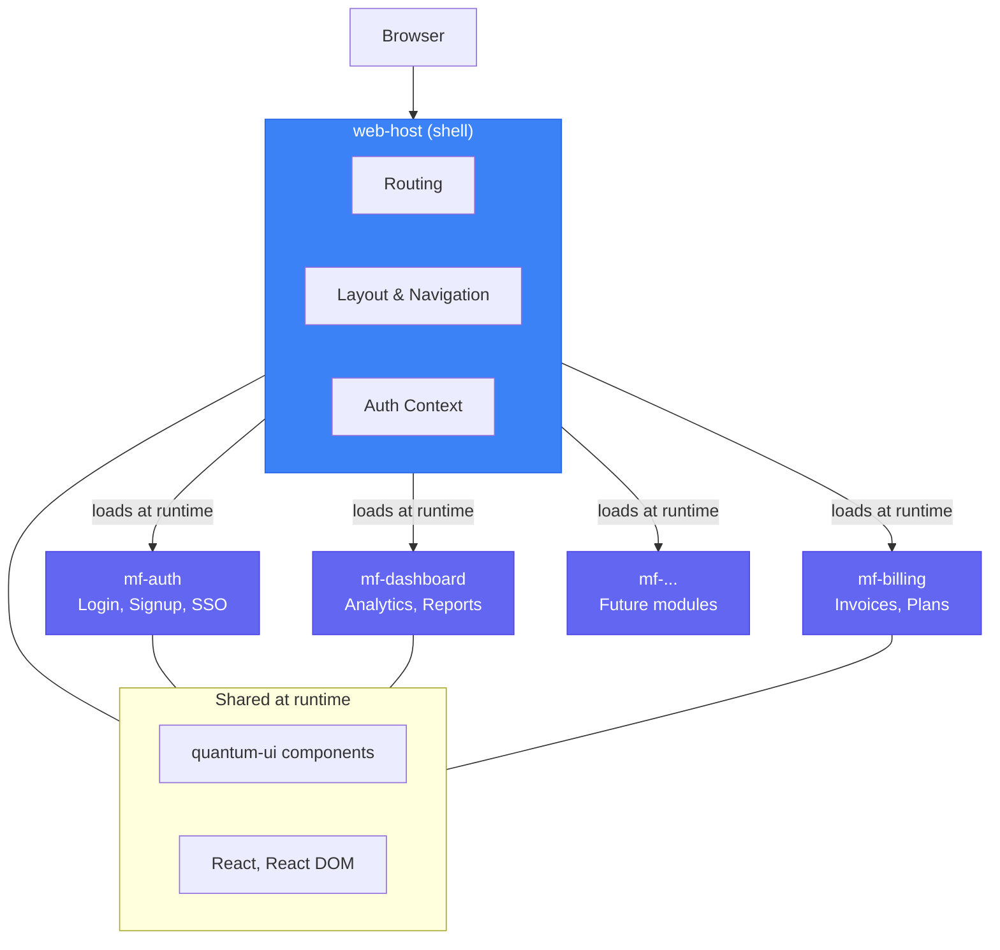
```mermaid
graph TB
    BROWSER[Browser] --> HOST

    subgraph HOST["web-host (shell)"]
        ROUTER[Routing]
        LAYOUT[Layout & Navigation]
        AUTH[Auth Context]
    end

    HOST -->|"loads at runtime"| MFA[mf-auth<br/>Login, Signup, SSO]
    HOST -->|"loads at runtime"| MFD[mf-dashboard<br/>Analytics, Reports]
    HOST -->|"loads at runtime"| MFB[mf-billing<br/>Invoices, Plans]
    HOST -->|"loads at runtime"| MFX[mf-...<br/>Future modules]

    subgraph shared["Shared at runtime"]
        QUI[quantum-ui components]
        REACT[React, React DOM]
    end

    HOST --- shared
    MFA --- shared
    MFD --- shared
    MFB --- shared

    style HOST fill:#3b82f6,stroke:#2563eb,color:#fff
    style MFA fill:#6366f1,stroke:#4f46e5,color:#fff
    style MFD fill:#6366f1,stroke:#4f46e5,color:#fff
    style MFB fill:#6366f1,stroke:#4f46e5,color:#fff
    style MFX fill:#6366f1,stroke:#4f46e5,color:#fff
```

**How this works at runtime:** The host app loads in the browser. When a user navigates to `/auth/login`, the host fetches `mf-auth`'s `remoteEntry.js` file, which tells it where to find the actual code chunks. The MF loads dynamically — the host never bundles MF code at build time.

**Why we do this:** Each MF can be built, versioned, and deployed independently. If we fix a bug in `mf-auth`, we don't need to rebuild or redeploy `mf-dashboard`. The host discovers MFs at runtime through a config object:

```js
window.__MF_CONFIG__ = {
  "mf-auth": "/mf-auth/remoteEntry.js",
  "mf-dashboard": "/mf-dashboard/remoteEntry.js",
  "mf-billing": "/mf-billing/remoteEntry.js"
};
```

This config is injected during deployment by vritti-cloud — it's not hardcoded.

### 2.2 Mobile Application — React Native + Repack MF

The mobile app uses Expo with Repack, which brings Module Federation to React Native. The same MF architecture applies — a host shell loads MF bundles dynamically, either bundled into the binary or fetched over-the-air.

The mobile app and its MFs use **quantum-ui-native** for shared components.

### 2.3 Backend — API Gateway + Microservices + RabbitMQ

The backend follows a microservices architecture with an API gateway pattern.

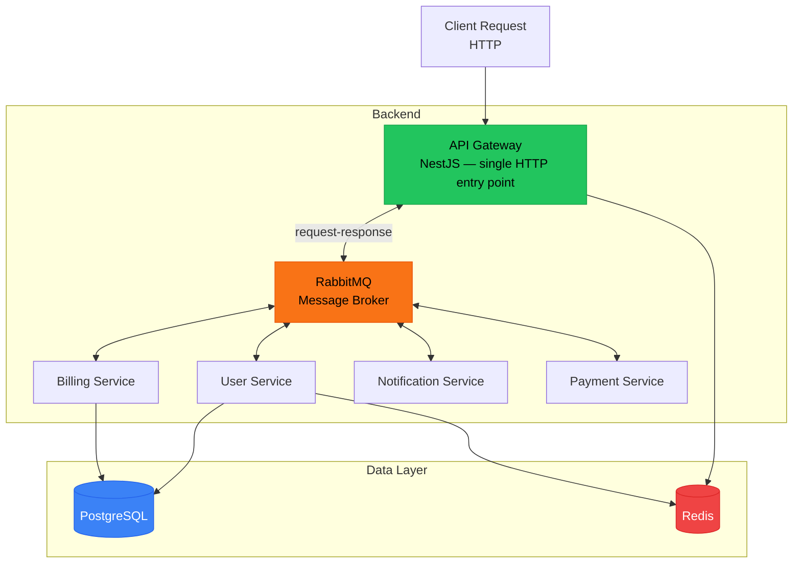
```mermaid
graph TB
    CLIENT[Client Request<br/>HTTP] --> GW

    subgraph backend["Backend"]
        GW[API Gateway<br/>NestJS — single HTTP entry point]

        RMQ[RabbitMQ<br/>Message Broker]

        US[User Service]
        BS[Billing Service]
        NS[Notification Service]
        PS[Payment Service]

        GW <-->|request-response| RMQ
        RMQ <--> US
        RMQ <--> BS
        RMQ <--> NS
        RMQ <--> PS
    end

    subgraph data["Data Layer"]
        PG[(PostgreSQL)]
        RD[(Redis)]
    end

    US --> PG
    BS --> PG
    GW --> RD
    US --> RD

    style GW fill:#22c55e,stroke:#16a34a,color:#000
    style RMQ fill:#f97316,stroke:#ea580c,color:#000
    style PG fill:#3b82f6,stroke:#2563eb,color:#fff
    style RD fill:#ef4444,stroke:#dc2626,color:#fff
```

**The API Gateway** is the only service exposed to the outside world. It receives HTTP requests from clients, authenticates them, resolves the tenant, and routes them to the appropriate microservice via RabbitMQ.

**RabbitMQ** is the message broker that decouples the gateway from the microservices. We use two communication patterns:

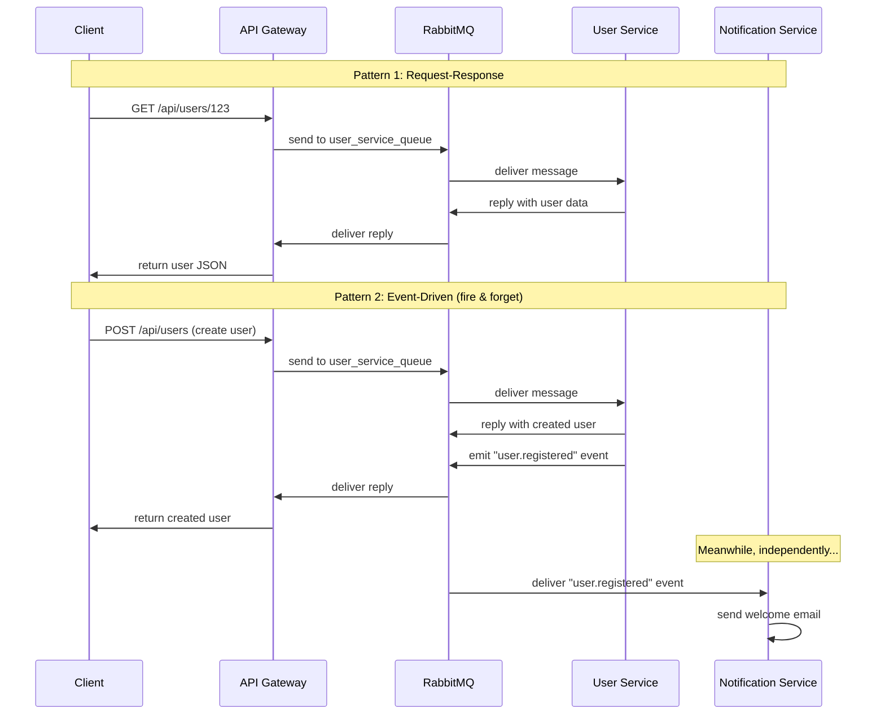
```mermaid
sequenceDiagram
    participant C as Client
    participant GW as API Gateway
    participant RMQ as RabbitMQ
    participant US as User Service
    participant NS as Notification Service

    Note over C,NS: Pattern 1: Request-Response
    C->>GW: GET /api/users/123
    GW->>RMQ: send to user_service_queue
    RMQ->>US: deliver message
    US->>RMQ: reply with user data
    RMQ->>GW: deliver reply
    GW->>C: return user JSON

    Note over C,NS: Pattern 2: Event-Driven (fire & forget)
    C->>GW: POST /api/users (create user)
    GW->>RMQ: send to user_service_queue
    RMQ->>US: deliver message
    US->>RMQ: reply with created user
    US->>RMQ: emit "user.registered" event
    RMQ->>GW: deliver reply
    GW->>C: return created user

    Note over NS: Meanwhile, independently...
    RMQ->>NS: deliver "user.registered" event
    NS->>NS: send welcome email
```

**Request-Response** is for when the client needs data back — the gateway sends a message to a service queue and waits for a reply. **Event-Driven** is for side effects — after creating a user, the user-service emits a `user.registered` event that the notification-service picks up to send a welcome email. The gateway doesn't wait for the email to be sent.

**PostgreSQL** is the primary database. **Redis** handles caching and session management.

### 2.4 How Products Talk to Each Other

vally and vritti-cloud communicate with vritti-platform through webhooks — they send HTTP requests to vritti-platform's API gateway.

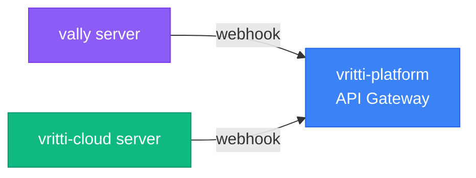
```mermaid
graph LR
    VY[vally server] -->|webhook| VP_GW[vritti-platform<br/>API Gateway]
    VC[vritti-cloud server] -->|webhook| VP_GW

    style VP_GW fill:#3b82f6,stroke:#2563eb,color:#fff
    style VY fill:#8b5cf6,stroke:#7c3aed,color:#fff
    style VC fill:#10b981,stroke:#059669,color:#fff
```

---

## 3. Shared Libraries

We have three shared libraries that prevent code duplication across products.

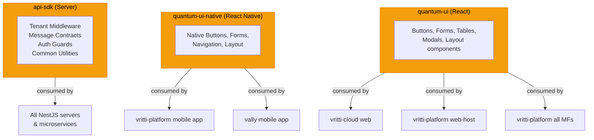
```mermaid
graph TB
    subgraph quantum-ui["quantum-ui (React)"]
        QUI_COMP[Buttons, Forms, Tables,<br/>Modals, Layout components]
    end

    subgraph quantum-ui-native["quantum-ui-native (React Native)"]
        QUIN_COMP[Native Buttons, Forms,<br/>Navigation, Layout]
    end

    subgraph api-sdk["api-sdk (Server)"]
        SDK_COMP[Tenant Middleware<br/>Message Contracts<br/>Auth Guards<br/>Common Utilities]
    end

    quantum-ui -->|consumed by| CW[vritti-cloud web]
    quantum-ui -->|consumed by| WH[vritti-platform web-host]
    quantum-ui -->|consumed by| MFS[vritti-platform all MFs]

    quantum-ui-native -->|consumed by| MA[vritti-platform mobile app]
    quantum-ui-native -->|consumed by| VA[vally mobile app]

    api-sdk -->|consumed by| SERVERS[All NestJS servers<br/>& microservices]

    style quantum-ui fill:#f59e0b,stroke:#d97706,color:#000
    style quantum-ui-native fill:#f59e0b,stroke:#d97706,color:#000
    style api-sdk fill:#f59e0b,stroke:#d97706,color:#000
```

Each library has its own Git repo and is published to our private npm registry with semantic versioning. When we release `quantum-ui@3.0.0`, each consuming project can choose when to upgrade.

**Important:** these libraries are installed at the individual package level, not at any monorepo root. So inside vritti-platform, `mf-auth/package.json` has `quantum-ui` as a dependency, `mf-dashboard/package.json` has it too — independently. This lets different MFs pin different versions if needed during a gradual upgrade.

---

## 4. Git Repository Structure

We currently use a **poly repo** approach — each project and library lives in its own Git repository.

### 4.1 Current State — Poly Repos


```mermaid
graph TB
    subgraph repos["Current Git Repositories"]
        direction TB
        R1[quantum-ui repo]
        R2[quantum-ui-native repo]
        R3[api-sdk repo]
        R4[vritti-platform-web-host repo]
        R5[vritti-platform-mf-auth repo]
        R6[vritti-platform-mf-dashboard repo]
        R7[vritti-platform-mf-billing repo]
        R8[vritti-platform-api-gateway repo]
        R9[vritti-platform-user-service repo]
        R10[vritti-platform-billing-service repo]
        R11[vritti-platform-notification-service repo]
        R12[vritti-platform-mobile-app repo]
        R13[vritti-cloud-web repo]
        R14[vritti-cloud-server repo]
        R15[vally-app repo]
        R16[vally-server repo]
        R17[...]
    end

    style repos fill:#1e293b,stroke:#334155,color:#fff
```

Each repo has its own CI pipeline, its own `package.json`, its own build. When we make a cross-cutting change (like upgrading `quantum-ui`), we open separate PRs in every consuming repo. A shared type change in `api-sdk` requires coordinated updates across multiple repos.

### 4.2 Target State — Monorepos

The plan is to consolidate into **6 repositories**: 3 monorepos for products, 3 standalone repos for libraries.

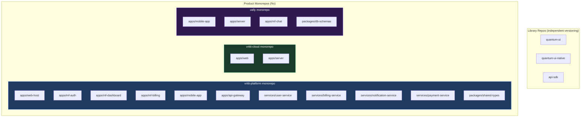
```mermaid
graph TB
    subgraph libs["Library Repos (independent versioning)"]
        L1[quantum-ui]
        L2[quantum-ui-native]
        L3[api-sdk]
    end

    subgraph monorepos["Product Monorepos (Nx)"]
        subgraph VP["vritti-platform monorepo"]
            VP_WH[apps/web-host]
            VP_MFA[apps/mf-auth]
            VP_MFD[apps/mf-dashboard]
            VP_MFB[apps/mf-billing]
            VP_MA[apps/mobile-app]
            VP_GW[apps/api-gateway]
            VP_US[services/user-service]
            VP_BS[services/billing-service]
            VP_NS[services/notification-service]
            VP_PS[services/payment-service]
            VP_PKG[packages/shared-types]
        end

        subgraph VCR["vritti-cloud monorepo"]
            VC_W[apps/web]
            VC_S[apps/server]
        end

        subgraph VYR["vally monorepo"]
            VY_A[apps/mobile-app]
            VY_S[apps/server]
            VY_MF[apps/mf-chat]
            VY_PKG[packages/db-schemas]
        end
    end

    style VP fill:#1e3a5f,stroke:#2563eb,color:#fff
    style VCR fill:#1a3a2a,stroke:#059669,color:#fff
    style VYR fill:#2d1b4e,stroke:#7c3aed,color:#fff
```

**Why Nx for the monorepos?** We chose Nx over Turborepo because Nx has first-class support for Module Federation (understands host-remote relationships), an official NestJS plugin, source-code-level dependency analysis (not just `package.json`), and custom target definitions per project (which we need for docker builds, OCI pushes, migrations, etc.).

**Why keep libraries as separate repos?** Because they're consumed across multiple monorepos. They need their own release cycle, their own changelog, and their own semver. Publishing from a monorepo to be consumed by other monorepos adds unnecessary complexity.

---

## 5. Build Pipeline and Artifacts

### 5.1 How CI Works in the Monorepo

In the poly repo world, every push to any repo triggers a full build for that repo. In the monorepo world, a single CI pipeline runs only what's affected by the change.

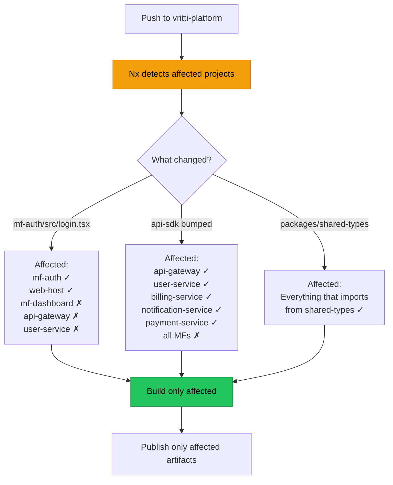
```mermaid
graph TB
    PUSH[Push to vritti-platform] --> DETECT[Nx detects affected projects]

    DETECT --> CHANGED{What changed?}

    CHANGED -->|"mf-auth/src/login.tsx"| AFF1[Affected:<br/>mf-auth ✓<br/>web-host ✓<br/>mf-dashboard ✗<br/>api-gateway ✗<br/>user-service ✗]

    CHANGED -->|"api-sdk bumped"| AFF2[Affected:<br/>api-gateway ✓<br/>user-service ✓<br/>billing-service ✓<br/>notification-service ✓<br/>payment-service ✓<br/>all MFs ✗]

    CHANGED -->|"packages/shared-types"| AFF3[Affected:<br/>Everything that imports<br/>from shared-types ✓]

    AFF1 --> BUILD[Build only affected]
    AFF2 --> BUILD
    AFF3 --> BUILD

    BUILD --> PUBLISH[Publish only affected artifacts]

    style DETECT fill:#f59e0b,stroke:#d97706,color:#000
    style BUILD fill:#22c55e,stroke:#16a34a,color:#000
```

Nx analyzes the source code dependency graph. If you change a file in `mf-auth`, Nx knows that `web-host` depends on `mf-auth` (because it's an MF remote), so both get rebuilt. But `mf-dashboard`, `api-gateway`, and all microservices are untouched — they don't build, test, or publish.

If `api-sdk` gets bumped, Nx detects that all backend services import from it, so all backend images get rebuilt. But no frontend artifacts change.

### 5.2 What Each Project Builds Into

Different parts of the platform produce different artifact types.

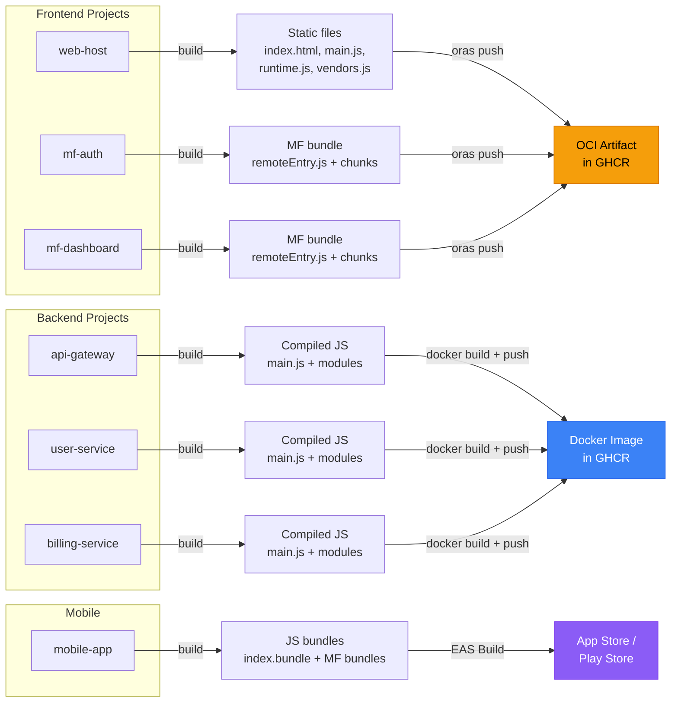
```mermaid
graph LR
    subgraph frontend["Frontend Projects"]
        WH[web-host]
        MFA[mf-auth]
        MFD[mf-dashboard]
    end

    subgraph backend["Backend Projects"]
        GW[api-gateway]
        US[user-service]
        BS[billing-service]
    end

    subgraph mobile["Mobile"]
        MA[mobile-app]
    end

    WH -->|build| WH_OUT["Static files<br/>index.html, main.js,<br/>runtime.js, vendors.js"]
    MFA -->|build| MFA_OUT["MF bundle<br/>remoteEntry.js + chunks"]
    MFD -->|build| MFD_OUT["MF bundle<br/>remoteEntry.js + chunks"]

    GW -->|build| GW_OUT["Compiled JS<br/>main.js + modules"]
    US -->|build| US_OUT["Compiled JS<br/>main.js + modules"]
    BS -->|build| BS_OUT["Compiled JS<br/>main.js + modules"]

    MA -->|build| MA_OUT["JS bundles<br/>index.bundle + MF bundles"]

    WH_OUT -->|"oras push"| OCI[OCI Artifact<br/>in GHCR]
    MFA_OUT -->|"oras push"| OCI
    MFD_OUT -->|"oras push"| OCI

    GW_OUT -->|"docker build + push"| DOCKER[Docker Image<br/>in GHCR]
    US_OUT -->|"docker build + push"| DOCKER
    BS_OUT -->|"docker build + push"| DOCKER

    MA_OUT -->|"EAS Build"| STORES[App Store /<br/>Play Store]

    style OCI fill:#f59e0b,stroke:#d97706,color:#000
    style DOCKER fill:#3b82f6,stroke:#2563eb,color:#fff
    style STORES fill:#8b5cf6,stroke:#7c3aed,color:#fff
```

**Frontend** projects produce static files (HTML, JS, CSS). These are packaged as **OCI artifacts** — basically versioned tarballs stored in the same GHCR registry as our Docker images. They're pulled and extracted to disk (on VM) or into pods (on Kubernetes) at deploy time.

**Backend** projects compile TypeScript to JavaScript and get packaged into **Docker images** with a lightweight Node.js base. Each service has its own image with its own version tag.

**Mobile** goes through Expo's EAS Build for app store binaries and EAS Update for over-the-air JS bundle updates.

**Why OCI artifacts for frontend instead of Docker images?** Because on a single VM, we don't want to run 5+ nginx containers just to serve static files. OCI artifacts are just files — we extract them to disk and one nginx serves everything. On Kubernetes, the same OCI artifacts get pulled by init containers into pods.

### 5.3 The Release Manifest

After CI builds everything, it produces a release manifest — a JSON file that maps every component to its artifact tag:

```json
{
  "version": "2.1.0",
  "frontend": {
    "web-host":     "ghcr.io/vritti/web-host:2.1.0",
    "mf-auth":      "ghcr.io/vritti/mf-auth:2.1.0",
    "mf-dashboard": "ghcr.io/vritti/mf-dashboard:2.1.0",
    "mf-billing":   "ghcr.io/vritti/mf-billing:2.1.0"
  },
  "backend": {
    "api-gateway":          "ghcr.io/vritti/api-gateway:2.1.0",
    "user-service":         "ghcr.io/vritti/user-service:2.1.0",
    "billing-service":      "ghcr.io/vritti/billing-service:2.1.0",
    "notification-service": "ghcr.io/vritti/notification-service:2.1.0",
    "payment-service":      "ghcr.io/vritti/payment-service:2.1.0"
  }
}
```

This manifest is what vritti-cloud uses to deploy. It doesn't care how the artifacts were built — just where they are and what version they represent.

### 5.4 CI Notifies vritti-cloud

After building and publishing artifacts, CI sends a webhook to vritti-cloud:

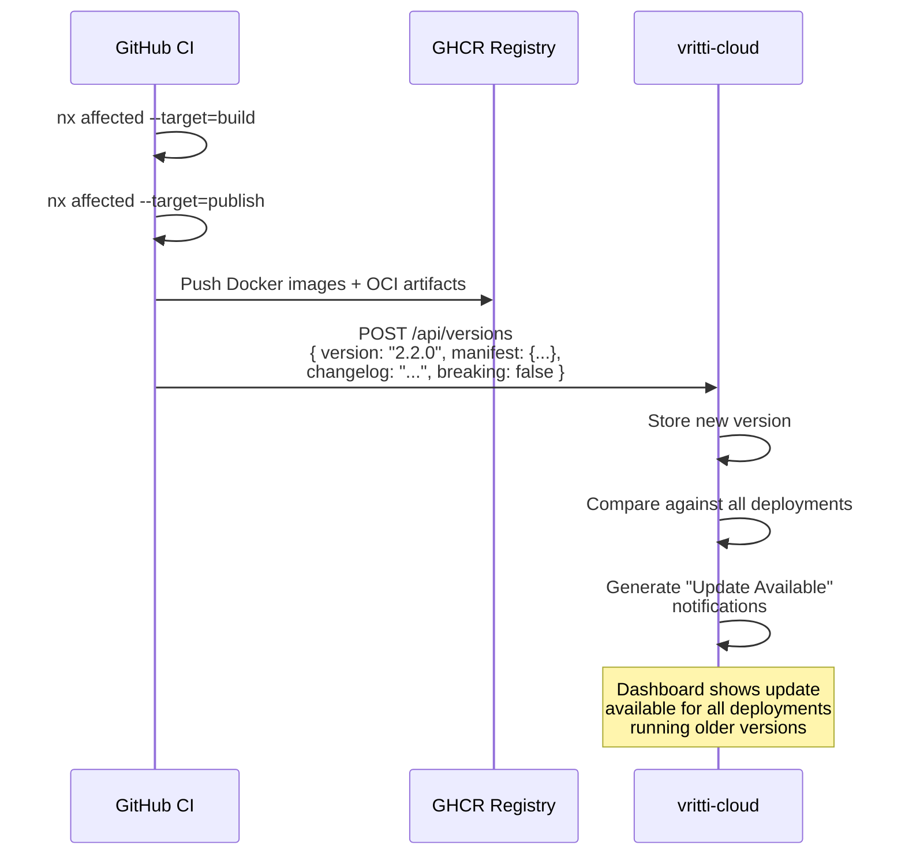
```mermaid
sequenceDiagram
    participant CI as GitHub CI
    participant GHCR as GHCR Registry
    participant VC as vritti-cloud

    CI->>CI: nx affected --target=build
    CI->>CI: nx affected --target=publish
    CI->>GHCR: Push Docker images + OCI artifacts

    CI->>VC: POST /api/versions<br/>{ version: "2.2.0", manifest: {...},<br/>changelog: "...", breaking: false }

    VC->>VC: Store new version
    VC->>VC: Compare against all deployments
    VC->>VC: Generate "Update Available"<br/>notifications

    Note over VC: Dashboard shows update<br/>available for all deployments<br/>running older versions
```

---

## 6. Deployment Architecture

### 6.1 Two Deployment Models

We have two types of client deployments:

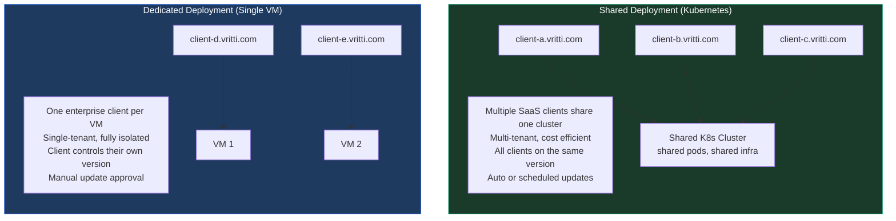
```mermaid
graph TB
    subgraph shared["Shared Deployment (Kubernetes)"]
        direction TB
        S_DESC["Multiple SaaS clients share one cluster<br/>Multi-tenant, cost efficient<br/>All clients on the same version<br/>Auto or scheduled updates"]

        S_C1[client-a.vritti.com]
        S_C2[client-b.vritti.com]
        S_C3[client-c.vritti.com]

        S_C1 --> S_CLUSTER[Shared K8s Cluster<br/>shared pods, shared infra]
        S_C2 --> S_CLUSTER
        S_C3 --> S_CLUSTER
    end

    subgraph dedicated["Dedicated Deployment (Single VM)"]
        direction TB
        D_DESC["One enterprise client per VM<br/>Single-tenant, fully isolated<br/>Client controls their own version<br/>Manual update approval"]

        D_C1[client-d.vritti.com] --> D_VM1[VM 1]
        D_C2[client-e.vritti.com] --> D_VM2[VM 2]
    end

    style shared fill:#1a3a2a,stroke:#059669,color:#fff
    style dedicated fill:#1e3a5f,stroke:#2563eb,color:#fff
```

**Shared (Kubernetes):** Multiple SaaS clients on one cluster. They share the same running pods, same database instance (isolated by schema), same Redis, same RabbitMQ. Cost efficient, but all clients run the same version.

**Dedicated (Single VM):** One enterprise client per VM. Fully isolated — own database, own Redis, own RabbitMQ. The client controls when they upgrade. More expensive but complete isolation.

### 6.2 Single VM — How It's Deployed

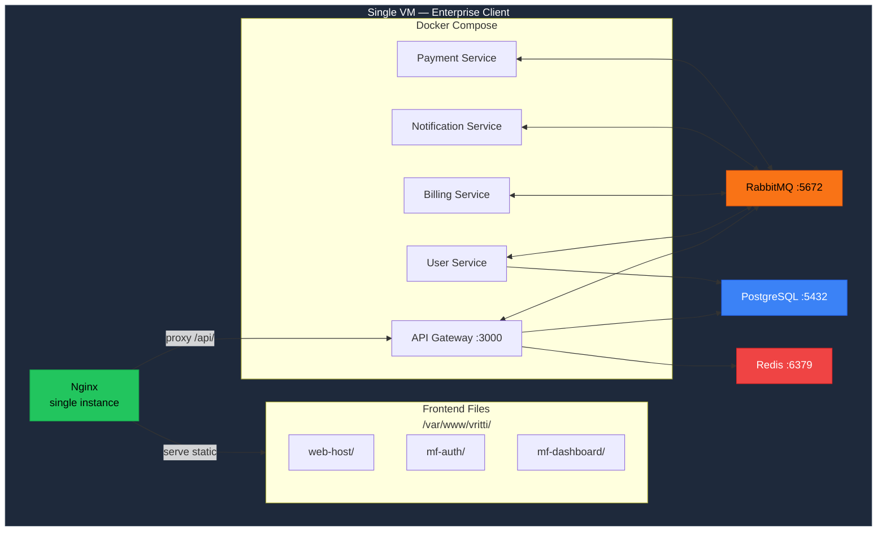
```mermaid
graph TB
    subgraph VM["Single VM — Enterprise Client"]
        NGINX[Nginx<br/>single instance]

        subgraph static["Frontend Files<br/>/var/www/vritti/"]
            WH[web-host/]
            MFA[mf-auth/]
            MFD[mf-dashboard/]
        end

        subgraph docker["Docker Compose"]
            GW[API Gateway :3000]
            US[User Service]
            BS[Billing Service]
            NS[Notification Service]
            PS[Payment Service]
        end

        RMQ[RabbitMQ :5672]
        PG[PostgreSQL :5432]
        RD[Redis :6379]

        NGINX -->|"serve static"| static
        NGINX -->|"proxy /api/"| GW
        GW <--> RMQ
        US <--> RMQ
        BS <--> RMQ
        NS <--> RMQ
        PS <--> RMQ
        GW --> PG
        GW --> RD
        US --> PG
    end

    style VM fill:#1e293b,stroke:#334155,color:#fff
    style NGINX fill:#22c55e,stroke:#16a34a,color:#000
    style RMQ fill:#f97316,stroke:#ea580c,color:#000
    style PG fill:#3b82f6,stroke:#2563eb,color:#fff
    style RD fill:#ef4444,stroke:#dc2626,color:#fff
```

One nginx instance serves all frontend files from disk and proxies API requests to the gateway container. Backend services run as Docker Compose containers communicating through RabbitMQ on the internal Docker network. Only the gateway is exposed to nginx — microservices are internal only.

**When vritti-cloud deploys to a VM:**

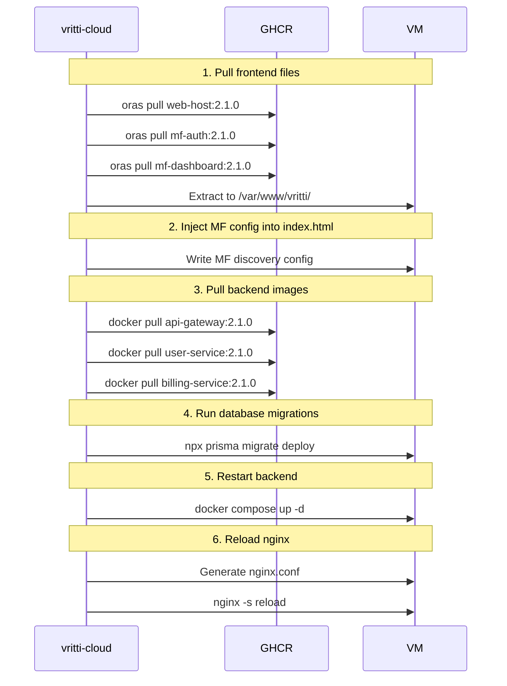
```mermaid
sequenceDiagram
    participant VC as vritti-cloud
    participant GHCR as GHCR
    participant VM as VM

    Note over VC,VM: 1. Pull frontend files
    VC->>GHCR: oras pull web-host:2.1.0
    VC->>GHCR: oras pull mf-auth:2.1.0
    VC->>GHCR: oras pull mf-dashboard:2.1.0
    VC->>VM: Extract to /var/www/vritti/

    Note over VC,VM: 2. Inject MF config into index.html
    VC->>VM: Write MF discovery config

    Note over VC,VM: 3. Pull backend images
    VC->>GHCR: docker pull api-gateway:2.1.0
    VC->>GHCR: docker pull user-service:2.1.0
    VC->>GHCR: docker pull billing-service:2.1.0

    Note over VC,VM: 4. Run database migrations
    VC->>VM: npx prisma migrate deploy

    Note over VC,VM: 5. Restart backend
    VC->>VM: docker compose up -d

    Note over VC,VM: 6. Reload nginx
    VC->>VM: Generate nginx.conf
    VC->>VM: nginx -s reload
```

### 6.3 Kubernetes — How It's Deployed

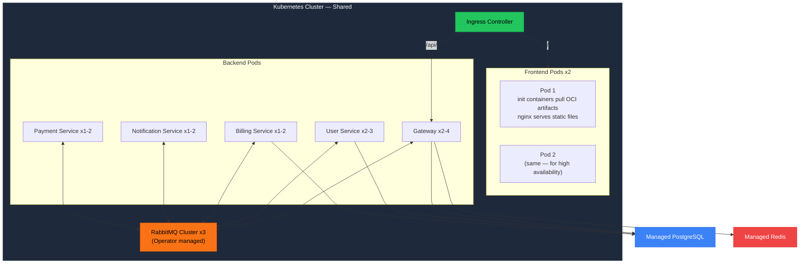
```mermaid
graph TB
    subgraph K8S["Kubernetes Cluster — Shared"]
        ING[Ingress Controller]

        subgraph frontend["Frontend Pods x2"]
            FP1["Pod 1<br/>init containers pull OCI artifacts<br/>nginx serves static files"]
            FP2["Pod 2<br/>(same — for high availability)"]
        end

        subgraph backend["Backend Pods"]
            GW["Gateway x2-4"]
            US["User Service x2-3"]
            BS["Billing Service x1-2"]
            NS["Notification Service x1-2"]
            PS["Payment Service x1-2"]
        end

        RMQ["RabbitMQ Cluster x3<br/>(Operator managed)"]

        ING -->|"/"| frontend
        ING -->|"/api/"| GW
        GW <--> RMQ
        US <--> RMQ
        BS <--> RMQ
        NS <--> RMQ
        PS <--> RMQ
    end

    PG["Managed PostgreSQL"]
    RD["Managed Redis"]

    GW --> PG
    GW --> RD
    US --> PG
    BS --> PG

    style K8S fill:#1e293b,stroke:#334155,color:#fff
    style ING fill:#22c55e,stroke:#16a34a,color:#000
    style RMQ fill:#f97316,stroke:#ea580c,color:#000
    style PG fill:#3b82f6,stroke:#2563eb,color:#fff
    style RD fill:#ef4444,stroke:#dc2626,color:#fff
```

On Kubernetes, frontend files are pulled into pods by init containers instead of being extracted to a VM filesystem. Backend services run as Kubernetes Deployments with multiple replicas. Kubernetes handles load balancing, rolling updates, and self-healing. An Ingress resource replaces the VM's nginx config for routing.

The key difference: **multiple replicas of everything**. If a pod dies, Kubernetes replaces it. If traffic spikes, pods can autoscale. Zero-downtime deploys happen automatically through rolling updates.

---

## 7. Multi-Tenancy — How Multiple Clients Share One Deployment

In the shared Kubernetes model, multiple clients hit the same running pods. We need to isolate their data.

### 7.1 Tenant Resolution Flow

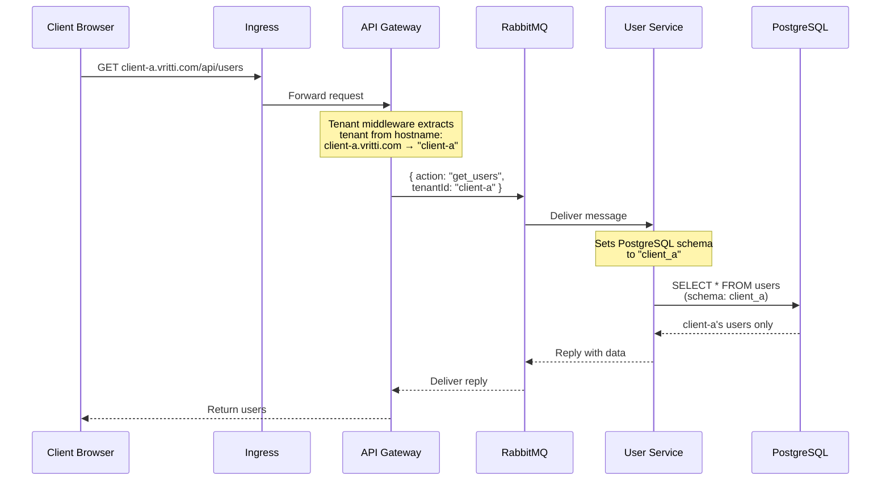
```mermaid
sequenceDiagram
    participant C as Client Browser
    participant ING as Ingress
    participant GW as API Gateway
    participant RMQ as RabbitMQ
    participant US as User Service
    participant PG as PostgreSQL

    C->>ING: GET client-a.vritti.com/api/users
    ING->>GW: Forward request

    Note over GW: Tenant middleware extracts<br/>tenant from hostname:<br/>client-a.vritti.com → "client-a"

    GW->>RMQ: { action: "get_users",<br/>tenantId: "client-a" }
    RMQ->>US: Deliver message

    Note over US: Sets PostgreSQL schema<br/>to "client_a"

    US->>PG: SELECT * FROM users<br/>(schema: client_a)
    PG-->>US: client-a's users only
    US-->>RMQ: Reply with data
    RMQ-->>GW: Deliver reply
    GW-->>C: Return users
```

The tenant middleware (defined in `api-sdk` so all services use the same logic) extracts the tenant ID from the hostname. Every message sent via RabbitMQ includes the `tenantId`. Every database query scopes to the tenant's schema.

### 7.2 Database Isolation — Schema Per Tenant

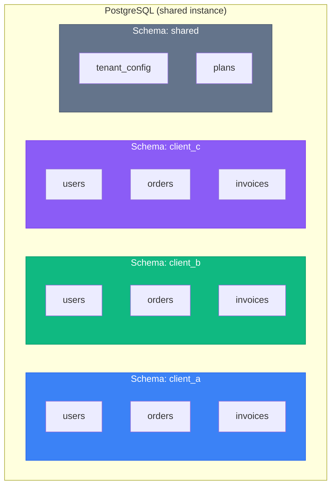
```mermaid
graph TB
    subgraph PG["PostgreSQL (shared instance)"]
        subgraph SA["Schema: client_a"]
            SA_U[users]
            SA_O[orders]
            SA_I[invoices]
        end

        subgraph SB["Schema: client_b"]
            SB_U[users]
            SB_O[orders]
            SB_I[invoices]
        end

        subgraph SC["Schema: client_c"]
            SC_U[users]
            SC_O[orders]
            SC_I[invoices]
        end

        subgraph SS["Schema: shared"]
            SS_T[tenant_config]
            SS_P[plans]
        end
    end

    style SA fill:#3b82f6,stroke:#2563eb,color:#fff
    style SB fill:#10b981,stroke:#059669,color:#fff
    style SC fill:#8b5cf6,stroke:#7c3aed,color:#fff
    style SS fill:#64748b,stroke:#475569,color:#fff
```

Each client gets their own Postgres schema with identical tables. The `shared` schema holds cross-tenant data like plan definitions and tenant configuration. The application sets the Postgres search path per request based on the tenant ID.

Dedicated VM clients get their own Postgres instance entirely — no schema isolation needed.

### 7.3 Redis and RabbitMQ Tenancy

**Redis:** All keys are prefixed with the tenant ID — `client-a:session:xyz`, `client-b:cache:users`. Simple and effective. The `api-sdk` provides a tenant-aware Redis wrapper.

**RabbitMQ:** Tenant ID is included in every message payload. The queue infrastructure is shared — isolation is at the message level. Services extract the tenant context from each message before processing.

### 7.4 Frontend Tenancy

All clients use the same frontend code. The frontend calls `GET /api/tenant/config` after loading, and the server returns tenant-specific settings — branding, theme colors, which MFs are enabled, feature flags. The UI adapts at runtime.

---

## 8. vritti-cloud — How Deployment Management Works

### 8.1 Version Tracking

vritti-cloud knows about every available version (from CI webhooks) and every deployment's current version.

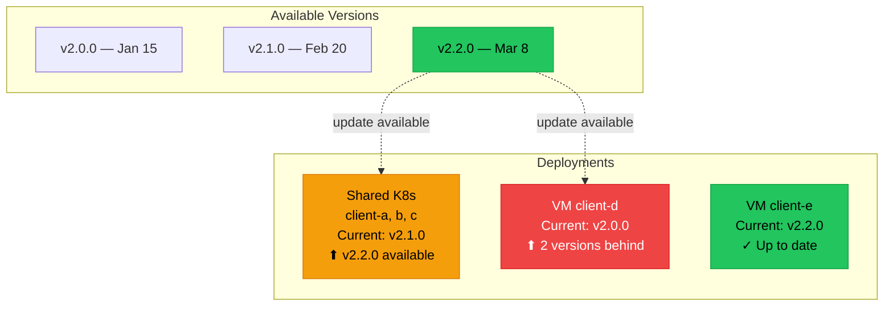
```mermaid
graph TB
    subgraph versions["Available Versions"]
        V1["v2.0.0 — Jan 15"]
        V2["v2.1.0 — Feb 20"]
        V3["v2.2.0 — Mar 8"]
    end

    subgraph deployments["Deployments"]
        D1["Shared K8s<br/>client-a, b, c<br/>Current: v2.1.0<br/>⬆ v2.2.0 available"]
        D2["VM client-d<br/>Current: v2.0.0<br/>⬆ 2 versions behind"]
        D3["VM client-e<br/>Current: v2.2.0<br/>✓ Up to date"]
    end

    V3 -.->|"update available"| D1
    V3 -.->|"update available"| D2

    style V3 fill:#22c55e,stroke:#16a34a,color:#000
    style D1 fill:#f59e0b,stroke:#d97706,color:#000
    style D2 fill:#ef4444,stroke:#dc2626,color:#fff
    style D3 fill:#22c55e,stroke:#16a34a,color:#000
```

When a new version is published, vritti-cloud compares it against all deployments and surfaces "Update Available" notifications in the dashboard. It also computes the upgrade path — if a client is 2 versions behind and there's a breaking change in between, it shows the stepped upgrade sequence.

### 8.2 Update Policies

Different clients have different update preferences:

- **Auto** — deploy immediately when a new version is available (typical for shared SaaS clients)
- **Manual** — show the notification in the dashboard, wait for the operator to approve (typical for enterprise)
- **Scheduled** — auto-deploy during the client's maintenance window (e.g., Sunday 2-6 AM UTC)

### 8.3 Deploy Driver Abstraction

vritti-cloud's core logic (manifest parsing, config generation, version tracking, upgrade paths) is shared across all deployment types. Only the final deploy execution differs:

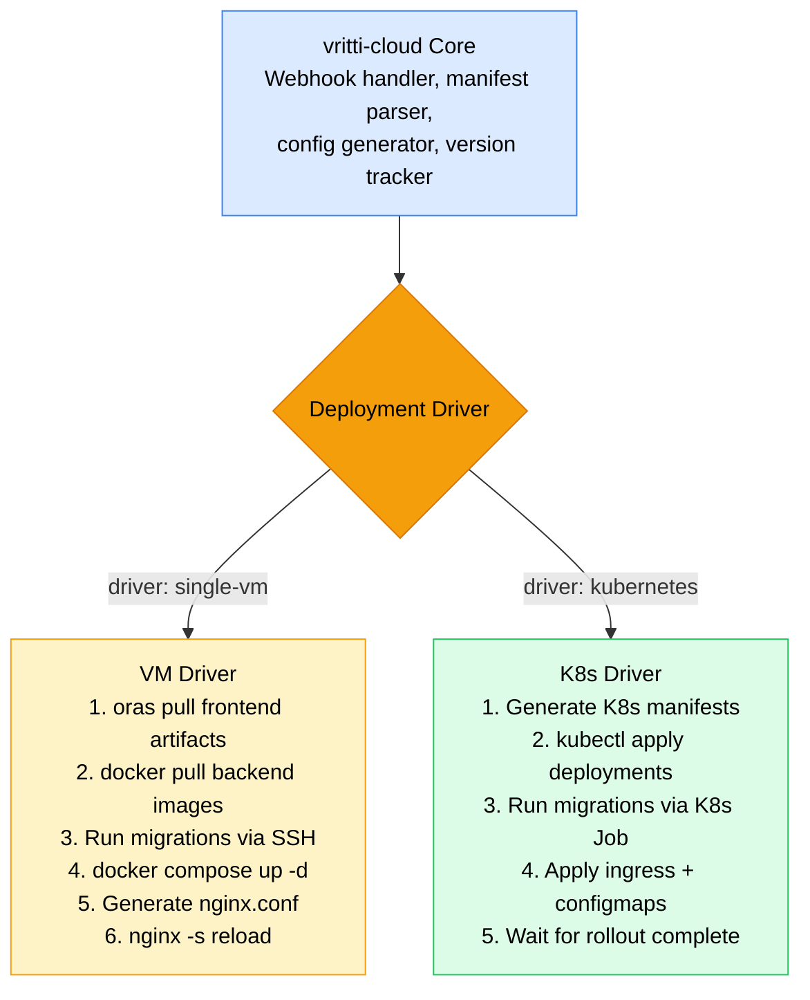
```mermaid
graph TB
    CORE[vritti-cloud Core<br/>Webhook handler, manifest parser,<br/>config generator, version tracker]

    CORE --> DRIVER{Deployment Driver}

    DRIVER -->|"driver: single-vm"| VM_D["VM Driver<br/>1. oras pull frontend artifacts<br/>2. docker pull backend images<br/>3. Run migrations via SSH<br/>4. docker compose up -d<br/>5. Generate nginx.conf<br/>6. nginx -s reload"]

    DRIVER -->|"driver: kubernetes"| K8S_D["K8s Driver<br/>1. Generate K8s manifests<br/>2. kubectl apply deployments<br/>3. Run migrations via K8s Job<br/>4. Apply ingress + configmaps<br/>5. Wait for rollout complete"]

    style CORE fill:#dbeafe,stroke:#3b82f6,color:#000
    style DRIVER fill:#f59e0b,stroke:#d97706,color:#000
    style VM_D fill:#fef3c7,stroke:#f59e0b,color:#000
    style K8S_D fill:#dcfce7,stroke:#22c55e,color:#000
```

---

## 9. Infrastructure — What's Not in the Release Manifest

Databases, Redis, and RabbitMQ are **infrastructure** — they're provisioned once per deployment and managed separately from application deploys. They are NOT in the release manifest.

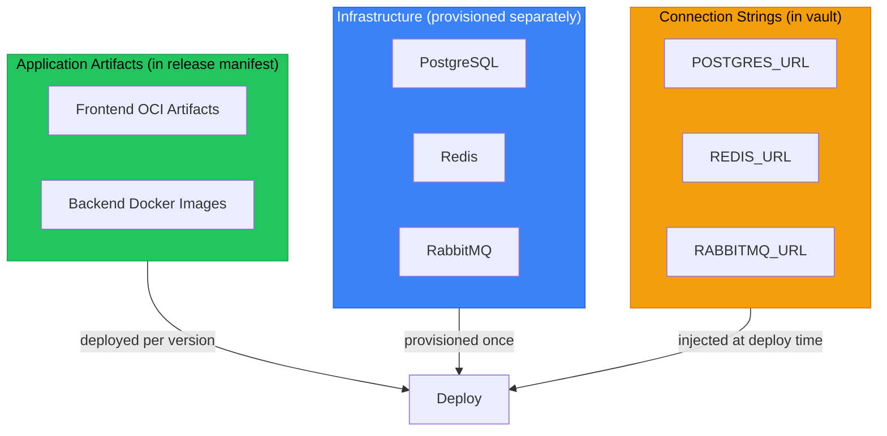
```mermaid
graph TB
    subgraph app_artifacts["Application Artifacts (in release manifest)"]
        FE[Frontend OCI Artifacts]
        BE[Backend Docker Images]
    end

    subgraph infra["Infrastructure (provisioned separately)"]
        PG[PostgreSQL]
        RD[Redis]
        RMQ[RabbitMQ]
    end

    subgraph secrets["Connection Strings (in vault)"]
        S1["POSTGRES_URL"]
        S2["REDIS_URL"]
        S3["RABBITMQ_URL"]
    end

    app_artifacts -->|"deployed per version"| DEPLOY[Deploy]
    infra -->|"provisioned once"| DEPLOY
    secrets -->|"injected at deploy time"| DEPLOY

    style app_artifacts fill:#22c55e,stroke:#16a34a,color:#000
    style infra fill:#3b82f6,stroke:#2563eb,color:#fff
    style secrets fill:#f59e0b,stroke:#d97706,color:#000
```

When vritti-cloud deploys v2.1.0, it pulls the application artifacts from GHCR and injects the infrastructure connection strings from the client's vault config. The application code doesn't know or care whether it's connecting to a Postgres on the same VM or a managed RDS instance in the cloud.

Database **migrations** are the one place where infrastructure touches the deploy pipeline. vritti-cloud runs migrations before rolling out new backend containers to ensure the database schema matches what the new code expects. Migrations are always backward-compatible so the old version can still run during the rollout.

---

## 10. Scaling

### 10.1 Single VM

Vertical scaling only — make the VM bigger. Nginx serving static files is never the bottleneck (handles 20,000-200,000+ req/sec). The limits are backend processing, database connections, and RabbitMQ throughput.

### 10.2 Kubernetes

Horizontal scaling with autoscaling:

```mermaid
graph LR
    subgraph scaling["Kubernetes Scaling"]
        FE_S["Frontend pods: 2<br/>(for HA, not performance)"]
        GW_S["Gateway: 2-4 pods<br/>(HPA on CPU)"]
        US_S["User Service: 2-3 pods<br/>(HPA on queue depth)"]
        BS_S["Billing Service: 1-2 pods"]
        NS_S["Notification Service: 1-2 pods"]
        RMQ_S["RabbitMQ: 3 nodes<br/>(operator managed)"]
        PG_S["PostgreSQL: 1 primary + 2 replicas"]
        RD_S["Redis: 3 nodes (sentinel)"]
    end
```

Each service scales independently based on its own load. The gateway might need more replicas than the notification service because it handles all inbound traffic. RabbitMQ acts as a natural buffer — if a service falls behind, messages queue up and get processed when capacity is available.

---

## 11. VM → Kubernetes Migration Path

When an enterprise client outgrows a single VM, the migration is straightforward because our artifacts are deployment-target agnostic.

```mermaid
graph LR
    VM["Single VM<br/>(current)"] -->|"Same artifacts<br/>different driver"| K8S["Kubernetes<br/>(future)"]

    subgraph unchanged["Nothing changes"]
        CI[CI Pipeline]
        ARTIFACTS[Docker Images + OCI Artifacts]
        MANIFEST[Release Manifest]
        CODE[Application Code]
    end

    subgraph changes["Only this changes"]
        CONFIG["vritti-cloud client config<br/>driver: single-vm → kubernetes"]
    end

    style VM fill:#3b82f6,stroke:#2563eb,color:#fff
    style K8S fill:#10b981,stroke:#059669,color:#fff
    style unchanged fill:#dbeafe,stroke:#3b82f6,color:#000
    style changes fill:#fef3c7,stroke:#f59e0b,color:#000
```

The same Docker images run on Kubernetes. The same OCI artifacts get pulled into pods instead of onto a filesystem. We just switch the driver in vritti-cloud's client config and redeploy. No rebuilds, no re-tagging, no code changes.

The main effort is migrating the database (setting up replication from the VM's Postgres to a new managed instance) and switching DNS. The application migration itself is trivial.

---

## 12. Summary — How Everything Connects

```mermaid
graph TB
    DEV[Developer pushes code] --> GH[GitHub]

    GH --> CI[GitHub CI<br/>nx affected → build → publish]

    CI --> GHCR[GHCR Registry<br/>Docker images + OCI artifacts]
    CI -->|webhook| VC[vritti-cloud]

    VC --> DASH[Dashboard<br/>shows versions, update status,<br/>deploy controls]

    DASH -->|"Deploy to shared"| K8S[Kubernetes Cluster<br/>multi-tenant<br/>SaaS clients]

    DASH -->|"Deploy to dedicated"| VM[Single VM<br/>single-tenant<br/>enterprise clients]

    K8S --> GHCR
    VM --> GHCR

    subgraph on_k8s["Running on K8s"]
        K_FE[Frontend pods]
        K_BE[Backend pods]
        K_RMQ[RabbitMQ]
        K_DB[Managed DB]
    end

    subgraph on_vm["Running on VM"]
        V_NGINX[Nginx + static files]
        V_DOCKER[Docker Compose containers]
        V_RMQ[RabbitMQ]
        V_DB[PostgreSQL]
    end

    K8S --> on_k8s
    VM --> on_vm

    style CI fill:#f59e0b,stroke:#d97706,color:#000
    style GHCR fill:#6366f1,stroke:#4f46e5,color:#fff
    style VC fill:#10b981,stroke:#059669,color:#fff
    style K8S fill:#3b82f6,stroke:#2563eb,color:#fff
    style VM fill:#8b5cf6,stroke:#7c3aed,color:#fff
```

The developer pushes code. CI builds and publishes only what's affected. vritti-cloud gets notified of the new version. The operator (or auto-policy) triggers a deploy. vritti-cloud pulls the right artifacts from GHCR and deploys them using the appropriate driver — Kubernetes for shared, single VM for dedicated. The same artifacts, the same manifest, the same application — just deployed differently based on the client's needs.
